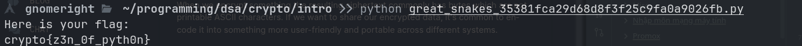
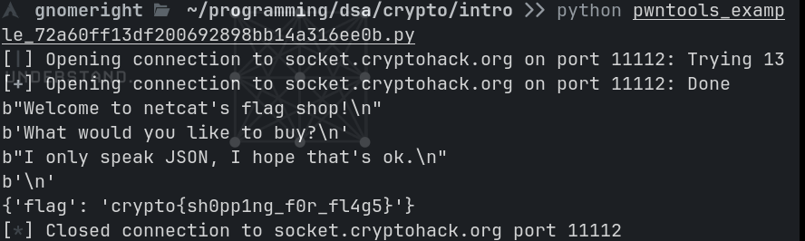
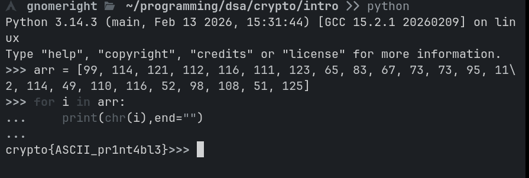
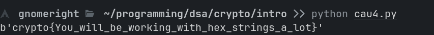
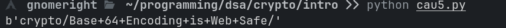

- [[#A Bộ thử thách cơ bản.|A Bộ thử thách cơ bản.]]
	- [[#A Bộ thử thách cơ bản.#Introduction|Introduction]]
	- [[#A Bộ thử thách cơ bản.#General|General]]
	- [[#A Bộ thử thách cơ bản.#Mathematics|Mathematics]]
	- [[#A Bộ thử thách cơ bản.#Symmetric Ciphers|Symmetric Ciphers]]


## A Bộ thử thách cơ bản.
### Introduction
- Câu 1
	chỉ cần copy + paste flag
- Câu 2: Tải về và chạy file bằng python là ra 
	
- Câu 3:
	Sửa lại code mẫu từ `buy:clothes` thành `buy:flag` như hướng dẫn
	Ta có kết quả 
	
### General
- ASCII:
	Ta viết code mã hóa bằng python và lấy flag 
	
- Hex:
	Sử dụng đoạn code sau 
	```python 
			encrypted_messege ="63727970746f7b596f755f77696c6c5f62655f776f726b696e675f776974685f6865785f737472696e67735f615f6c6f747d"

	print(str(bytes.fromhex(encrypted_messege)))

	```
	ta có flag là
	
- Base64:
	Sử dụng đoạn code sau 
	```python 
		import base64

		encrypted_messenge = "72bca9b68fc16ac7beeb8f849dca1d8a783e8acf9679bf9269f7bf"

		base64_messege = base64.b64encode(bytes.fromhex(encrypted_messenge))

		print(base64_messege)
	```
	ta có kết quả 
	
-  Bytes and big integers
	Viết code như hướng dẫn, ta có kết quả 
		
- Encoding challenge
	Đây là một bài khó. Đề cho 2 file. File `13377.py` đại diện cho code ở sever. FIle `pwntools_example.py` đại diện cho code để giải mã
	Đọc file 13377.py ta thấy thực chất file này sẽ cho ta một encode messege và tên loại mã hóa đạ sử dụng ( trong 1 pool từ base64,hex, rot13, bigint, utf8) Sau đó nó kiểm tra kết quả trả về của người dùng có đúng ? Nếu đúng thì lặp lại 100 lần sẽ trả lại flag cho ta
	
	```python 
		def challenge(self, your_input):

		if self.stage == 0:

		return self.create_level()

		elif self.stage == 100:

		self.exit = True

		return {"flag": FLAG}

  

		if self.challenge_words == your_input["decoded"]:

		return self.create_level()

  

	return {"error": "Decoding fail"}
	```


	Sửa lại đoạn code pwn. 
	```python 
	from pwn import * # pip install pwntools

	import json

import base64

import codecs

from Crypto.Util.number import bytes_to_long, long_to_bytes

  

r = remote('socket.cryptohack.org', 13377, level = 'debug')

  

def json_recv():

line = r.recvline()

return json.loads(line.decode())

  

def json_send(hsh):

request = json.dumps(hsh).encode()

r.sendline(request)

  
  

# receive 100 times.

  

for i in range(100):

received = json_recv()

  

print("Received type: ")

print(received["type"])

print("Received encoded value: ")

print(received["encoded"])

  
  

if received["type"] == "base64":

decoded = base64.b64decode(received["encoded"]).decode()

elif received["type"] == "hex":

decoded = bytes.fromhex(received["encoded"]).decode()

elif received["type"] == "rot13":

decoded = codecs.decode(received["encoded"], 'rot_13')

elif received["type"] == "bigint":

decoded = long_to_bytes(int(received["encoded"], 16)).decode()

elif received["type"] == "utf-8":

decoded = "".join([chr(b) for b in received["encoded"]])

  

to_send = {

"decoded": decoded

}

  

json_send(to_send)

  
  

json_recv()

print("Received type: ")

print(received["type"])

print("Received encoded value: ")

print(received["encoded"])
	```
Chạy và ta có được flag 


- Xor starter
	Làm theo đề bài, ta có đoạn code xor chữ `label` 
	```python
	text = "label"
key = 13
new_string = ""

for char in text:
   
    new_string += chr(ord(char) ^ key)

print(f"crypto{{{new_string}}}")
	```
	ta có kết quả 
	
	
- XOR properties:
	 Dựa vào manh mối. Ta lấy key2^ key3, key1 để xor với flag ^ key1 ^ key2 ^ key3 thì sẽ ra được flag ( do các key123 tự triệt tiêu lẫn nhau thành flag ^ 0 = flag)
	 Ta có code giải 
	```python 
	from pwn import xor

  

# Các dữ kiện đề bài cho (dưới dạng hex)

key1 = "a6c8b6733c9b22de7bc0253266a3867df55acde8635e19c73313"

key2_xor_key3 = "c1545756687e7573db23aa1c3452a098b71a7fbf0fddddde5fc1"

flag_xor_all = "04ee9855208a2cd59091d04767ae47963170d1660df7f56f5faf"

  

# Chuyển từ hex sang bytes

v1 = bytes.fromhex(key1)

v3 = bytes.fromhex(key2_xor_key3)

v4 = bytes.fromhex(flag_xor_all)

  

# Thực hiện phép tính: FLAG = v4 ^ v1 ^ v3

# Tính chất XOR cho phép ta XOR liên tiếp nhiều biến

result = xor(v4, v1, v3)

  

print(f"flag:{result.decode()}")
	```
	Ta có kết quả: 
	
- Favourite Byte
	- Câu này có 2 hướng giải. 1 là ta brute force dò từng byte.  2 là đoán. 
	  Do flag format là `crypto{}` nên ta có thể suy ra chữ đầu là c
		(ASCII `99` hay hex `63`).
	    Công thức: $73 \oplus key = 63 \implies key = 73 \oplus 63$
		=> key = 16
		Ta cũng có thể viết code brute force 
		```python 
		from pwn import xor

  

hex_data = "73626960647f6b206821204f21254f7d694f7624662065622127234f726927756d"

data = bytes.fromhex(hex_data)

  

for key in range(256):

decoded = xor(data, key)

try:

text = decoded.decode('utf-8')

if "crypto{" in text:

print(f"Success! Key: {key}")

print(f"Flag: {text}")

except UnicodeDecodeError:

pass
		``` 
	
- You either know, XOR you don't
	Làm tương tự chiến thuật dò format flag ở trên. Ta tính 
	- $Plaintext \oplus Key = Ciphertext$
    
- Suy ra: **$Key = Ciphertext \oplus Plaintext$ = myXORkey**
	Ta có đoạn code giải mã
	```python
	from pwn import xor

  

hex_data = "0e0b213f26041e480b26217f27342e175d0e070a3c5b103e2526217f27342e175d0e077e263451150104"

data = bytes.fromhex(hex_data)

  

key = b"myXORkey"

  

flag = xor(data, key)

print("Flag:", flag.decode())
	```
	Ta có kết quả 
	
- Lemur XOR
		Dựa vào gợi ý để bài. Em có suy nghĩ 
		Key ^ anh1 = rac 1 
		key ^ anh 2 = rac 2
		=> rac 2 ^ rac 1 = anh1 ^ anh 2 

	Có thể sẽ ra một bức ảnh ta cần. 
	Tuy nhiên, do đề bài gợi ý chỉ được xor các điểm rgb nên ta sử dụng pillow trong python để xử lý ảnh
	```python
	from PIL import Image

import numpy as np

  

# Open the two XOR encrypted images

img1 = Image.open('flag_7ae18c704272532658c10b5faad06d74.png')

img2 = Image.open('lemur_ed66878c338e662d3473f0d98eedbd0d.png')

  

# Convert images to numpy arrays

arr1 = np.array(img1)

arr2 = np.array(img2)

  

# XOR the RGB bytes

result_arr = np.bitwise_xor(arr1, arr2)

  

# Convert back to Image and save

result_img = Image.fromarray(result_arr)

result_img.save('result.png')

  

print("Saved XOR result to result.png")
	```
Kết quả:


- Greatest Common Divisor
	Bài này chỉ có toán. Đọc và bấm máy tính, ta có kết quả 
	
- Extended GCD
	Do GCD của 2 số nguyên nên ta có thể tự tin nói là GCD (p,q) = 1.
	Vậy ta có p.u + q.v = 1 Tới đây. Ta vẫn phải sử dụng tới code
	```python 
	def extended_gcd(a, b):
    if a == 0:
        return b, 0, 1
    else:
        gcd, x, y = extended_gcd(b % a, a)
        return gcd, y - (b // a) * x, x

p = 26513
q = 32321

gcd, u, v = extended_gcd(p, q)

print(f"gcd({p}, {q}) = {gcd}")
print(f"u = {u}")
print(f"v = {v}")
print(f"Kiểm tra: {p}*{u} + {q}*{v} = {p*u + q*v}")
	``` 
	Ra kết quả u  = 10246, v = -8404
	. Lấy -8404.

- Modular arithmetic1
	đọc công thức cho ở đề bài 
	`Another way of saying this, is that when we divide the integer aa by mm, the remainder is bb. This tells you that if mm divides aa (this can be written as m∣am∣a) then a≡0modma≡0modm.` 
		=> x = 11 % 6 = 5
		 y = 8146798528947 % 17 = 4
		Vậy ta lấy 4

- Modular Arithmetic 2
	Ta có công thức fermat Với p là số nguyên tố
	
	**Dạng 1:** $a^p \equiv a \pmod{p}$
    
	**Dạng 2:** Nếu $a$ không chia hết cho $p$, thì $a^{p-1} \equiv 1 \pmod{p}$

	vậy 
	3^17 mod 17  = 3
	5 ^17 mod 17 = 5 
	Sử dụng dạng 1
	 
	Với 273246787654 ^ 65536 mod 65537.
		Ta thấy 65536 = 65537 - 1, mà 65537 lại là số nguyên tố => Sử dụng công thức 2. Kết quả = 1

- Modular inverting
	Đề bài hỏi  3⋅d≡1mod13?
	
	Sử dụng dạng 2 của câu trên. Ta đoán p = 13. 
	Vậy lấy sao cho d * 3 = 3 ^ 12 
		vậy d = 3 ^ 11 (số lớn)  mod 13 = 9
		Vậy đáp án là 9
	
- Privacy enhance mail ?
	Đề bài có đưa ra 2 gợi ý để làm bài này. Sử dụng openssl và thư viện crypto ở python để giải 
	Ta có đoạn code python 
	
	```python 
	from Crypto.PublicKey import RSA

  

with open('privacy_enhanced_mail_1f696c053d76a78c2c531bb013a92d4a.pem', 'r') as f:

key_data = f.read()

  

key = RSA.importKey(key_data)

  

print(f"Giá trị d (decimal): {key.d}")
	```
	Được kết quả 
	
- CERTainly not
	Đọc thì em hiểu. ANS1 là lớp header. DER là một lớp mã hóa sang ngôn ngữ binary . Còn PEM là một wrapper để chuyển DER sang dạng text cho dễ đọc và copy. 

	Do ta đã có file DER. CHỉ cần đọc byte và sử dụng thư viện mã hóa RSA.importkey 
	```python
	from Crypto.PublicKey import RSA

from Crypto.Util.asn1 import DerSequence

from Crypto.Util.number import bytes_to_long

  

with open('2048b-rsa-example-cert_3220bd92e30015fe4fbeb84a755e7ca5.der', 'rb') as f:

der_data = f.read()

  
  

key = RSA.importKey(der_data)

print(f"Modulus (n) dạng Decimal: {key.n}")
	```
	Ta có kết quả 
	

- SSH keys
	Tiếp tục sử dụng để đọc key
	```python
	from Crypto.PublicKey import RSA

  

# Chuỗi key của Bruce (bạn copy nguyên dòng từ đề bài vào đây)

with open("bruce_rsa_6e7ecd53b443a97013397b1a1ea30e14.pub" , "r") as f:

ssh_key_string = f.read()

  

# Import trực tiếp

key = RSA.importKey(ssh_key_string)

  

# Trích xuất Modulus n

print(f"Modulus n (Decimal): {key.n}")
	```
	Kết quả là 
- Transparency 
	Bài này em gặp khó khăn. Ban đầu em có tự extract ra fingerprint của TLS trang web và search, nhưng không thấy
	Code bằng python
	
	```python
	import hashlib

import requests

from Crypto.PublicKey import RSA

  

pem = open('transparency_afff0345c6f99bf80eab5895458d8eab.pem', 'r').read()

key = RSA.importKey(pem).public_key()

  

der = key.exportKey(format='DER')

sha256 = hashlib.sha256(der)

sha256_fingerprint = sha256.hexdigest()

  

print(f"Public Key SHA256: {sha256_fingerprint}")
	```


em có thử lại bằng CLI 
```bash
openssl x509 -in transparency_afff0345c6f99bf80eab5895458d8eab.pem -pubkey -noout | openssl pkey -pubin -outform der | openssl dgst -sha256 
Could not find certificate from transparency_afff0345c6f99bf80eab5895458d8eab.pem
800B6931427F0000:error:1608010C:STORE routines:ossl_store_handle_load_result:unsupported:crypto/store/store_result.c:160:provider=default
Could not find private key of Public Key from <stdin>
SHA2-256(stdin)= e3b0c44298fc1c149afbf4c8996fb92427ae41e4649b934ca495991b7852b855
```
Sau cùng, em thử chơi ngược. TÌm tất cả các subdomain của `cryptohack.org` em thấy có subdomain sus ở đây 


kết quả flag `crypto{thx_redpwn_for_inspiration}` 

### Mathematics
- Quadratic Residues
	Đề bài có gọi ý thuật toán cho ta. Vì vậy ta có thể viết code để giải
	```python
	p = 29

numbers = [14,6,11]

  

for num in numbers:

for i in range(0, p+1):

if i ** 2 % p == num:

print(i)
	```
	ta có kết quả
	
	Lấy số 8 

- Legendre symbol
	Dựa vào công thức ledgre. Nếu 
	(a/p)  =  (a ^ (p-1)/2) mod p = 1 nếu a là số quadratic residue. 
	Vậy ta tìm từ dãy số đã cho.
	
	Tuy nhiên, do số cực lớn, ta phải sử dụng hàm pow trong python chứ không thể tính toán chay kiểu a**(p-1)/2 % p được 
	
	Ta có code
```python
  

p = 101524035174539890485408575671085261788758965189060164484385690801466167356667036677932998889725476582421738788500738738503134356158197247473850273565349249573867251280253564698939768700489401960767007716413932851838937641880157263936985954881657889497583485535527613578457628399173971810541670838543309159139

  

ints = [25081841204695904475894082974192007718642931811040324543182130088804239047149283334700530600468528298920930150221871666297194395061462592781551275161695411167049544771049769000895119729307495913024360169904315078028798025169985966732789207320203861858234048872508633514498384390497048416012928086480326832803, 45471765180330439060504647480621449634904192839383897212809808339619841633826534856109999027962620381874878086991125854247108359699799913776917227058286090426484548349388138935504299609200377899052716663351188664096302672712078508601311725863678223874157861163196340391008634419348573975841578359355931590555, 17364140182001694956465593533200623738590196990236340894554145562517924989208719245429557645254953527658049246737589538280332010533027062477684237933221198639948938784244510469138826808187365678322547992099715229218615475923754896960363138890331502811292427146595752813297603265829581292183917027983351121325, 14388109104985808487337749876058284426747816961971581447380608277949200244660381570568531129775053684256071819837294436069133592772543582735985855506250660938574234958754211349215293281645205354069970790155237033436065434572020652955666855773232074749487007626050323967496732359278657193580493324467258802863, 4379499308310772821004090447650785095356643590411706358119239166662089428685562719233435615196994728767593223519226235062647670077854687031681041462632566890129595506430188602238753450337691441293042716909901692570971955078924699306873191983953501093343423248482960643055943413031768521782634679536276233318, 85256449776780591202928235662805033201684571648990042997557084658000067050672130152734911919581661523957075992761662315262685030115255938352540032297113615687815976039390537716707854569980516690246592112936796917504034711418465442893323439490171095447109457355598873230115172636184525449905022174536414781771, 50576597458517451578431293746926099486388286246142012476814190030935689430726042810458344828563913001012415702876199708216875020997112089693759638454900092580746638631062117961876611545851157613835724635005253792316142379239047654392970415343694657580353333217547079551304961116837545648785312490665576832987, 96868738830341112368094632337476840272563704408573054404213766500407517251810212494515862176356916912627172280446141202661640191237336568731069327906100896178776245311689857997012187599140875912026589672629935267844696976980890380730867520071059572350667913710344648377601017758188404474812654737363275994871, 4881261656846638800623549662943393234361061827128610120046315649707078244180313661063004390750821317096754282796876479695558644108492317407662131441224257537276274962372021273583478509416358764706098471849536036184924640593888902859441388472856822541452041181244337124767666161645827145408781917658423571721, 18237936726367556664171427575475596460727369368246286138804284742124256700367133250078608537129877968287885457417957868580553371999414227484737603688992620953200143688061024092623556471053006464123205133894607923801371986027458274343737860395496260538663183193877539815179246700525865152165600985105257601565]

  

# Bước 1: Tìm số a là Quadratic Residue dùng Legendre Symbol

a_found = None

for a in ints:

if pow(a, (p - 1) // 2, p) == 1:

a_found = a

break

  

print(f"Số Quadratic Residue tìm thấy: {a_found}")

  

# Bước 2: Tính căn bậc hai theo công thức p = 3 mod 4

# x = a^((p+1)//4) mod p

root1 = pow(a_found, (p + 1) // 4, p)

root2 = p - root1

  

# Bước 3: Lấy căn lớn hơn làm flag

flag = max(root1, root2)

print(f"\nFlag (căn bậc hai lớn hơn): {flag}")

```

ta có kết quả 

- Modular square Root
	Ở bài trước, chúng ta dùng công thức $x = a^{(p+1)/4}$ vì $p \equiv 3 \pmod 4$. Nhưng khi $p \equiv 1 \pmod 4$, công thức đó **không hoạt động**.
	
	Vì vậy, ta phải sử dụng thuật toán Tonelli-Sharks. Hoạt động dựa trên việc phân tích số mũ $p-1$ thành dạng:

$$p - 1 = Q \cdot 2^S$$

(Trong đó $Q$ là số lẻ).

Tonelli-Shanks là thuật toán tổng quát hơn, nó giải quyết được phương trình $r^2 \equiv a \pmod p$ cho **mọi số nguyên tố lẻ** $p$.

Ta có code
```python
def legendre_symbol(a, p):

"""

Legendre symbol: Determines if 'a' is a quadratic residue modulo an odd prime 'p'.

[^1^][5](http://en.wikipedia.org/wiki/Legendre_symbol)

"""

ls = pow(a, (p - 1) // 2, p)

if ls == p - 1:

return -1

return ls

  

def prime_mod_sqrt(a, p):

  

a %= p

  

# Simple cases

if a == 0:

return [0]

if p == 2:

return [a]

  

# Check solution existence for odd prime

if legendre_symbol(a, p) != 1:

return []

  

# Simple case for p ≡ 3 (mod 4)

if p % 4 == 3:

x = pow(a, (p + 1) // 4, p)

return [x, p - x]

  

# Factor p-1 as q * 2^s (with Q odd)

q, s = p - 1, 0

while q % 2 == 0:

s += 1

q //= 2

  

# Select a z which is a quadratic non-residue modulo p

z = 1

while legendre_symbol(z, p) != -1:

z += 1

  

c = pow(z, q, p)

  

# Search for a solution

x = pow(a, (q + 1) // 2, p)

t = pow(a, q, p)

m = s

  

while t != 1:

# Find the lowest i such that t^(2^i) = 1

i, e = 0, 2

for i in range(1, m):

if pow(t, e, p) == 1:

break

e *= 2

  

# Update next value to iterate

b = pow(c, 2**(m - i - 1), p)

x = (x * b) % p

t = (t * b * b) % p

c = (b * b) % p

m = i

  

return [x, p - x]

  

if __name__ == "__main__":

a = 8479994658316772151941616510097127087554541274812435112009425778595495359700244470400642403747058566807127814165396640215844192327900454116257979487432016769329970767046735091249898678088061634796559556704959846424131820416048436501387617211770124292793308079214153179977624440438616958575058361193975686620046439877308339989295604537867493683872778843921771307305602776398786978353866231661453376056771972069776398999013769588936194859344941268223184197231368887060609212875507518936172060702209557124430477137421847130682601666968691651447236917018634902407704797328509461854842432015009878011354022108661461024768

  

p = 30531851861994333252675935111487950694414332763909083514133769861350960895076504687261369815735742549428789138300843082086550059082835141454526618160634109969195486322015775943030060449557090064811940139431735209185996454739163555910726493597222646855506445602953689527405362207926990442391705014604777038685880527537489845359101552442292804398472642356609304810680731556542002301547846635101455995732584071355903010856718680732337369128498655255277003643669031694516851390505923416710601212618443109844041514942401969629158975457079026906304328749039997262960301209158175920051890620947063936347307238412281568760161

  

solutions = prime_mod_sqrt(a, p)

print(f"Solutions for x^2 ≡ {a} (mod {p}): {min(solutions)}")
```

được kết quả 
`2362339307683048638327773298580489298932137505520500388338271052053734747862351779647314176817953359071871560041125289919247146074907151612762640868199621186559522068338032600991311882224016021222672243139362180461232646732465848840425458257930887856583379600967761738596782877851318489355679822813155123045705285112099448146426755110160002515592418850432103641815811071548456284263507805589445073657565381850521367969675699760755310784623577076440037747681760302434924932113640061738777601194622244192758024180853916244427254065441962557282572849162772740798989647948645207349737457445440405057156897508368531939120`
- Chinesse remainder theorem
	Đây là bài toán kinh điển về thặng dư trung hoa. Đọc https://drx.home.blog/2018/07/25/dinh-ly-so-du-trung-hoa/

	ta có code để giải thuật toán 
	```python
	def gcdExtended(a, b):
    global x, y
 
    if (a == 0):
        x = 0
        y = 1
        return b
 
    gcd = gcdExtended(b % a, a)
    x1 = x
    y1 = y
 
    x = y1 - (b // a) * x1
    y = x1
 
    return gcd
 
 
def modInverse(A, M):
 
    g = gcdExtended(A, M)
    if (g != 1):
        print("Inverse doesn't exist")
 
    else:
 
        res = (x % M + M) % M
        return res


M = 5 * 11 * 17
p1 = 5
p2 = 11
p3 = 17
a1 = 2
a2 = 3
a3 = 5
M1 = 11 * 17
M2 = 5 * 17
M3 = 5 * 11

y1 = modInverse(M1,p1)
y2 = modInverse(M2,p2)
y3 = modInverse(M3,p3)

flag = (a1*y1*M1 + a2*y2*M2 + a3*y3*M3) % M
print(flag)

	```
Kết quả 
- Successive powers
	1. Lập s(i+1) = s(i)*x % p, suy ra p là ước chung của các hiệu s(i)^2 - s(i-1)*s(i+1).
    
	2. Tính GCD(665^2 - 588_216, 216^2 - 665_113) = 919, xác định p = 919.
    
	3. Giải 588*x = 665 % 919 bằng cách tính x = (665 * 588^-1) % 919.
    
	4. Tính nghịch đảo 588^-1 % 919 = 683, kết quả x = (665 * 683) % 919 = 209.
	flag là `crypto{919,209}`

- Adrien's signs
	ĐOạn code encrypt thực hiện như sau 
	- **Chuyển đổi Flag:** Flag được chuyển thành một chuỗi nhị phân (bitstring).
    
	- **Mã hóa từng bit:** Với mỗi bit `b`:
    
    - Một số nguyên ngẫu nhiên `e` được chọn trong khoảng $[1, p]$.
        
    - Giá trị $n = a^e \pmod p$ được tính toán.
        
    - **Nếu bit là '1'**: Bản mã lưu giá trị $n$ ($n = a^e \pmod p$).
        
    - **Nếu bit là '0'**: Bản mã lưu giá trị $-n$ ($-a^e \pmod p$).
	Vậy ta có đoạn code dịch ngược 
	```python
	from Crypto.Util.number import long_to_bytes

  

a = 288260533169915

p = 1007621497415251

ciphertext = [67594220461269, 501237540280788, 718316769824518, 296304224247167, 48290626940198, 30829701196032, 521453693392074, 840985324383794, 770420008897119, 745131486581197, 729163531979577, 334563813238599, 289746215495432, 538664937794468, 894085795317163, 983410189487558, 863330928724430, 996272871140947, 352175210511707, 306237700811584, 631393408838583, 589243747914057, 538776819034934, 365364592128161, 454970171810424, 986711310037393, 657756453404881, 388329936724352, 90991447679370, 714742162831112, 62293519842555, 653941126489711, 448552658212336, 970169071154259, 339472870407614, 406225588145372, 205721593331090, 926225022409823, 904451547059845, 789074084078342, 886420071481685, 796827329208633, 433047156347276, 21271315846750, 719248860593631, 534059295222748, 879864647580512, 918055794962142, 635545050939893, 319549343320339, 93008646178282, 926080110625306, 385476640825005, 483740420173050, 866208659796189, 883359067574584, 913405110264883, 898864873510337, 208598541987988, 23412800024088, 911541450703474, 57446699305445, 513296484586451, 180356843554043, 756391301483653, 823695939808936, 452898981558365, 383286682802447, 381394258915860, 385482809649632, 357950424436020, 212891024562585, 906036654538589, 706766032862393, 500658491083279, 134746243085697, 240386541491998, 850341345692155, 826490944132718, 329513332018620, 41046816597282, 396581286424992, 488863267297267, 92023040998362, 529684488438507, 925328511390026, 524897846090435, 413156582909097, 840524616502482, 325719016994120, 402494835113608, 145033960690364, 43932113323388, 683561775499473, 434510534220939, 92584300328516, 763767269974656, 289837041593468, 11468527450938, 628247946152943, 8844724571683, 813851806959975, 72001988637120, 875394575395153, 70667866716476, 75304931994100, 226809172374264, 767059176444181, 45462007920789, 472607315695803, 325973946551448, 64200767729194, 534886246409921, 950408390792175, 492288777130394, 226746605380806, 944479111810431, 776057001143579, 658971626589122, 231918349590349, 699710172246548, 122457405264610, 643115611310737, 999072890586878, 203230862786955, 348112034218733, 240143417330886, 927148962961842, 661569511006072, 190334725550806, 763365444730995, 516228913786395, 846501182194443, 741210200995504, 511935604454925, 687689993302203, 631038090127480, 961606522916414, 138550017953034, 932105540686829, 215285284639233, 772628158955819, 496858298527292, 730971468815108, 896733219370353, 967083685727881, 607660822695530, 650953466617730, 133773994258132, 623283311953090, 436380836970128, 237114930094468, 115451711811481, 674593269112948, 140400921371770, 659335660634071, 536749311958781, 854645598266824, 303305169095255, 91430489108219, 573739385205188, 400604977158702, 728593782212529, 807432219147040, 893541884126828, 183964371201281, 422680633277230, 218817645778789, 313025293025224, 657253930848472, 747562211812373, 83456701182914, 470417289614736, 641146659305859, 468130225316006, 46960547227850, 875638267674897, 662661765336441, 186533085001285, 743250648436106, 451414956181714, 527954145201673, 922589993405001, 242119479617901, 865476357142231, 988987578447349, 430198555146088, 477890180119931, 844464003254807, 503374203275928, 775374254241792, 346653210679737, 789242808338116, 48503976498612, 604300186163323, 475930096252359, 860836853339514, 994513691290102, 591343659366796, 944852018048514, 82396968629164, 152776642436549, 916070996204621, 305574094667054, 981194179562189, 126174175810273, 55636640522694, 44670495393401, 74724541586529, 988608465654705, 870533906709633, 374564052429787, 486493568142979, 469485372072295, 221153171135022, 289713227465073, 952450431038075, 107298466441025, 938262809228861, 253919870663003, 835790485199226, 655456538877798, 595464842927075, 191621819564547]

  
  

bits = ""

for n in ciphertext:

# Tính ký hiệu Legendre sử dụng tiêu chuẩn Euler

if pow(n, (p - 1) // 2, p) == 1:

bits += "1"

else:

bits += "0"

  

# Chuyển chuỗi bit thành bytes

flag = long_to_bytes(int(bits, 2))

print(flag)
	```
kết quả


- Modular Binomials
	ta có 
	5·m1 − 2·m2 = 5(2p+3q) − 2(5p+7q) = q
3·m2 − 7·m1 = 3(5p+7q) − 7(2p+3q) = p
	Nếu ta tìm được m1 và m2 thì ta sẽ có được p và q

do `5·m1 − 2·m2 = q ≡ 0 (mod p)`, nên ta có thể suy ra `5·m1 ≡ 2·m2 (mod p)`.

Vậy m1 và m2 là residue mod p
=>
m1^(e1·e2) ≡ c1^e2   (mod p)
m1^(e1·e2) ≡ c2^e1 · (2/5)^(e1·e2)   (mod p)

=>
c1^e2 − c2^e1 · (2/5)^(e1·e2) ≡ 0  (mod p)

Ta có code để giải
```python
val   = (pow(c1, e2, N) - pow(c2, e1, N) * pow(2 * pow(5,-1,N) % N, e1*e2, N)) % N
p_or_q = gcd(val, N)
```

kết quả :
p = 112274000169258486390262064441991200608556376127408952701514962644340921899196091557519382763356534106376906489445103255177593594898966250176773605432765983897105047795619470659157057093771407309168345670541418772427807148039207489900810013783673957984006269120652134007689272484517805398390277308001719431273

q = 132760587806365301971479157072031448380135765794466787456948786731168095877956875295282661565488242190731593282663694728914945967253173047324353981530949360031535707374701705328450856944598803228299967009004598984671293494375599408764139743217465012770376728876547958852025425539298410751132782632817947101601

- broken RSA
	Gợi ý "kiểm tra tất cả các giải pháp có thể" + e=16 là chìa khóa. Vì e=16 = 2^4, nên lấy căn bậc eth có nghĩa là lấy 4 căn bậc hai liên tiếp, mỗi căn có khả năng nhân đôi số nghiệm. 
	
	Việc triển khai "bị hỏng" có hai sai sót khi phối hợp với nhau:
	
	Lỗi: n là số nguyên tố - họ không bao giờ nhân hai số nguyên tố với nhau. RSA thực yêu cầu n = p*q sao cho phi(n) = (p-1)(q-1) có nghịch đảo mô đun cho e. Với số nguyên tố n, gcd(16, n-1) = 8 ≠ 1, do đó không tồn tại số mũ giải mã d.

	Khai thác: Vì n là số nguyên tố nên Z_n* là nhóm tuần hoàn và căn bậc hai mô đun được xác định rõ. Vì e = 16 = 2^4 nên việc giải mã chỉ cần lấy 4 căn bậc hai liên tiếp mod n. Mỗi bước căn bậc hai có thể mang lại 2 nghiệm, cho ra tối đa 2^4 = 16 ứng viên nhưng vì gcd(16, n-1) = 8 nên tồn tại chính xác 8 nghiệm hợp lệ. Gợi ý "kiểm tra tất cả các giải pháp có thể" chỉ thẳng vào nhánh này.

ta có code
```python
from gmpy2 import mpz, powmod

n  = mpz(27772857409875257529415990911214211975844307184430241451899407838750503024323367895540981606586709985980003435082116995888017731426634845808624796292507989171497629109450825818587383112280639037484593490692935998202437639626747133650990603333094513531505209954273004473567193235535061942991750932725808679249964667090723480397916715320876867803719301313440005075056481203859010490836599717523664197112053206745235908610484907715210436413015546671034478367679465233737115549451849810421017181842615880836253875862101545582922437858358265964489786463923280312860843031914516061327752183283528015684588796400861331354873)
e  = 16
ct = mpz(11303174761894431146735697569489134747234975144162172162401674567273034831391936916397234068346115459134602443963604063679379285919302225719050193590179240191429612072131629779948379821039610415099784351073443218911356328815458050694493726951231241096695626477586428880220528001269746547018741237131741255022371957489462380305100634600499204435763201371188769446054925748151987175656677342779043435047048130599123081581036362712208692748034620245590448762406543804069935873123161582756799517226666835316588896306926659321054276507714414876684738121421124177324568084533020088172040422767194971217814466953837590498718)

# ── Why this works ───────────────────────────────────────────────────────────
# The "broken" part: n is PRIME (not p*q). With prime n, phi(n)=n-1.
# gcd(16, n-1) = 8, so e=16 has no inverse mod phi(n) and normal decryption fails.
# But with prime n we can compute e-th roots directly via iterated Tonelli-Shanks:
# take 4 successive square roots (since 16 = 2^4), collecting ±r at each step.
# This gives up to 2^4 = 16 candidates; exactly 8 satisfy m^16 ≡ ct (mod n).
# The flag is the one that decodes to a readable ASCII string.

def tonelli_shanks(a, p):
    """Modular square root: return r with r² ≡ a (mod p), or None."""
    if powmod(a, (p - 1) // 2, p) != 1:
        return None
    if p % 4 == 3:
        return powmod(a, (p + 1) // 4, p)
    q, s = p - 1, 0
    while q % 2 == 0:
        q //= 2; s += 1
    z = mpz(2)
    while powmod(z, (p - 1) // 2, p) != p - 1:
        z += 1
    m, c, t, r = s, powmod(z, q, p), powmod(a, q, p), powmod(a, (q + 1) // 2, p)
    while True:
        if t == 1: return r
        i, tmp = 1, t * t % p
        while tmp != 1:
            tmp = tmp * tmp % p; i += 1
        b = powmod(c, mpz(1) << (m - i - 1), p)
        m, c, t, r = i, b*b%p, t*b*b%p, r*b%p

# Four rounds of sqrt mod n  →  up to 2^4 = 16 candidates
candidates = [ct]
for _ in range(4):
    nxt = []
    for v in candidates:
        r = tonelli_shanks(v, n)
        if r is not None:
            nxt += [r, n - r]
    candidates = nxt

# Print the readable one
for m in candidates:
    if powmod(m, e, n) != ct:
        continue
    raw = int(m).to_bytes((int(m).bit_length() + 7) // 8, 'big')
    try:
        s = raw.decode('utf-8')
        if all(32 <= ord(c) < 127 for c in s):
            print(s)
    except UnicodeDecodeError:
        pass
```

kết quả

- No Way Back Home 
	Thay vì sử dụng phép lũy thừa $g^a \pmod n$ (bài toán logarit rời rạc khó), giao thức này lại sử dụng phép nhân $v \cdot k \pmod n$. Điều này biến một hệ thống bảo mật thành một phương trình tuyến tính lớp 6:

	$v_{ka} \cdot v_{kb} = (v \cdot k_A) \cdot (v \cdot k_B) = v \cdot (v \cdot k_A \cdot k_B) \equiv v \cdot v_{kakb} \pmod n$.
     **Lỗ hổng từ bội số của $p$**

	Bản thân $v$ được tạo ra là một bội số của $p$ ($v = p \cdot r \pmod n$). Điều này dẫn đến hai hệ quả:

	- **$v \equiv 0 \pmod p$**: Chúng ta đã biết một nửa giá trị của $v$ thông qua số dư với $p$.
    
	- **Không thể chia trực tiếp**: $v_{kakb}$ chia hết cho $p$ nên không có nghịch đảo modulo $n$. Do đó, ta không thể tính $v = (v_{ka} \cdot v_{kb}) / v_{kakb}$ trực tiếp trong modulo $n$.
    

	**Giải quyết bằng Modulo $q$ và CRT**

	Để vượt qua rào cản không có nghịch đảo, đoạn code thực hiện:

	**Tính $v \pmod q$**: Vì $q$ là số nguyên tố và không phải là nhân tử của $v_{kakb}$, ta có thể tính nghịch đảo của $v_{kakb}$ trong modulo $q$. Công thức là: $v_{mod\_q} = (v_{ka} \cdot v_{kb} \cdot v_{kakb}^{-1}) \pmod q$.
    
	**Khôi phục $v$ bằng CRT**: Kết hợp $v \equiv 0 \pmod p$ và $v \equiv v_{mod\_q} \pmod q$ bằng Định lý số dư Trung hoa để tìm lại giá trị $v$ ban đầu.

Ta có code
```python 
from math import gcd

from hashlib import sha256

from Crypto.Cipher import AES

from Crypto.Util.Padding import unpad

from Crypto.Util.number import long_to_bytes, inverse

  

# ── Given values ──────────────────────────────────────────────────────────────

p = 10699940648196411028170713430726559470427113689721202803392638457920771439452897032229838317321639599506283870585924807089941510579727013041135771337631951

q = 11956676387836512151480744979869173960415735990945471431153245263360714040288733895951317727355037104240049869019766679351362643879028085294045007143623763

n = p * q

  

vka = 124641741967121300068241280971408306625050636261192655845274494695382484894973990899018981438824398885984003880665335336872849819983045790478166909381968949910717906136475842568208640203811766079825364974168541198988879036997489130022151352858776555178444457677074095521488219905950926757695656018450299948207

vkakb = 114778245184091677576134046724609868204771151111446457870524843414356897479473739627212552495413311985409829523700919603502616667323311977056345059189257932050632105761365449853358722065048852091755612586569454771946427631498462394616623706064561443106503673008210435922340001958432623802886222040403262923652

vkb = 6568897840127713147382345832798645667110237168011335640630440006583923102503659273104899584827637961921428677335180620421654712000512310008036693022785945317428066257236409339677041133038317088022368203160674699948914222030034711433252914821805540365972835274052062305301998463475108156010447054013166491083

c = bytes.fromhex('fef29e5ff72f28160027959474fc462e2a9e0b2d84b1508f7bd0e270bc98fac942e1402aa12db6e6a36fb380e7b53323')

  

# ── Protocol recap ────────────────────────────────────────────────────────────

# v = p * r mod n (r random => v is a multiple of p mod n)

# vka = v * k_A mod n

# vkakb = vka * k_B mod n = v * k_A * k_B mod n

# vkb = vkakb * k_A^-1 mod n = v * k_B mod n

# v_s = vkb * k_B^-1 mod n = v (shared secret)

# key = SHA256(long_to_bytes(v))

  

# ── Vulnerability 1: v is a multiple of p ────────────────────────────────────

# v = p*r => gcd(v, n) = p.

# Multiplying by k_i (coprime to n) preserves that:

# gcd(vka, n) = gcd(v*k_A, n) = p (since gcd(k_A, n) = 1 by construction)

# So p leaks directly from any of the three published values.

  

assert gcd(vka, n) == p, "unexpected: gcd(vka,n) != p"

assert gcd(vkakb, n) == p, "unexpected: gcd(vkakb,n) != p"

assert gcd(vkb, n) == p, "unexpected: gcd(vkb,n) != p"

print("[+] p confirmed via gcd(vka, n)")

  

# ── Vulnerability 2: recover v with CRT ──────────────────────────────────────

# Note: vka * vkb = v^2 * k_A * k_B and vkakb = v * k_A * k_B mod n

# So: vka * vkb / vkakb = v mod n -- but vkakb is not invertible mod n (gcd = p).

#

# Fix: work mod q (where gcd(vkakb, q) = 1):

# v mod q = vka * vkb * inverse(vkakb, q) mod q

#

# We also know v mod p = 0 (since v = p*r).

# CRT reconstruction:

# v = p * inverse(p, q) * (v mod q) mod n

  

v_mod_q = vka * vkb % q * inverse(vkakb, q) % q

v = p * inverse(p, q) * v_mod_q % n

  

assert v % p == 0, "v is not a multiple of p — something went wrong"

print("[+] v recovered via CRT (v ≡ 0 mod p, v ≡ vka*vkb/vkakb mod q)")

  

# ── Decrypt ───────────────────────────────────────────────────────────────────

key = sha256(long_to_bytes(v)).digest()

flag = unpad(AES.new(key, AES.MODE_ECB).decrypt(c), 16)

print(f"\n[+] FLAG: {flag.decode()}")
```

- Elipse Cruve Cryptography 
	The vulnerability is that the author used the Pell-type conic
		x^2 - Dy^2 = 1 

	with D=23^2  which makes the “group of points” isomorphic to the simple multiplicative group Fp Then the supposedly hard custom-ECC discrete log becomes an ordinary finite-field discrete log. Sincep-1p−1 is smooth, Pohlig–Hellman breaks it quickly, giving the private key, shared secret, and finally the AES key.
	WE have the code 
	```python 
	from hashlib import sha1
from sympy.ntheory.residue_ntheory import discrete_log
from cryptography.hazmat.primitives.ciphers import Cipher, algorithms, modes

p = 173754216895752892448109692432341061254596347285717132408796456167143559
D = 529
s = 23

Gx = 29394812077144852405795385333766317269085018265469771684226884125940148
Gy = 94108086667844986046802106544375316173742538919949485639896613738390948

Ax = 155781055760279718382374741001148850818103179141959728567110540865590463
Ay = 73794785561346677848810778233901832813072697504335306937799336126503714

Bx = 171226959585314864221294077932510094779925634276949970785138593200069419
By = 54353971839516652938533335476115503436865545966356461292708042305317630

iv = bytes.fromhex("64bc75c8b38017e1397c46f85d4e332b")
ct = bytes.fromhex(
    "13e4d200708b786d8f7c3bd2dc5de0201f0d7879192e6603d7c5d6b963e1df2943e3ff75f7fda9c30a92171bbbc5acbf"
)

# Map points to F_p^*
g = (Gx + s * Gy) % p
au = (Ax + s * Ay) % p
bu = (Bx + s * By) % p

# Recover Alice private key
na = discrete_log(p, au, g)

# Shared element in multiplicative representation
u = pow(bu, na, p)

# Recover x-coordinate from u = x + 23y and u^-1 = x - 23y
shared_secret = ((u + pow(u, -1, p)) * pow(2, -1, p)) % p

# AES key derivation
key = sha1(str(shared_secret).encode("ascii")).digest()[:16]

cipher = Cipher(algorithms.AES(key), modes.CBC(iv))
dec = cipher.decryptor()
pt = dec.update(ct) + dec.finalize()

# PKCS#7 unpad
padlen = pt[-1]
print(pt[:-padlen].decode())

	```

flag: `crypto{c0n1c_s3ct10n5_4r3_f1n1t3_gr0up5}`

- Roll your own 
	
	
	solution code
	```python 
	from pwn import *
import json

HOST = "socket.cryptohack.org"
PORT = 13403

def recv_json_string_after_prefix(r, prefix: bytes) -> str:
    r.recvuntil(prefix)
    line = r.recvline().decode().strip()
    return json.loads(line)   # removes surrounding quotes

def recv_hex_after_prefix(r, prefix: bytes) -> int:
    s = recv_json_string_after_prefix(r, prefix)
    return int(s, 16)

def recv_json_obj(r):
    while True:
        line = r.recvline().decode(errors="ignore").strip()
        if not line:
            continue
        try:
            return json.loads(line)
        except json.JSONDecodeError:
            print(f"[debug] skipping non-json line: {line!r}")

def json_send(r, obj):
    r.sendline(json.dumps(obj).encode())

while True:
    r = remote(HOST, PORT)

    # Prime generated: "0x...."
    q = recv_hex_after_prefix(r, b"Prime generated: ")
    print(f"[+] q = {q}")

    r.recvuntil(b"Send integers (g,n) such that pow(g,q,n) = 1: ")

    g = q + 1
    n = q * q
    json_send(r, {"g": hex(g), "n": hex(n)})

    # Generated my public key: "0x...."
    h = recv_hex_after_prefix(r, b"Generated my public key: ")
    print(f"[+] h = {h}")

    r.recvuntil(b"What is my private key: ")

    # rare ambiguous case
    if h == 1:
        print("[!] h == 1, retrying")
        r.close()
        continue

    x = (h - 1) // q
    print(f"[+] recovered x = {x}")

    json_send(r, {"x": hex(x)})

    result = recv_json_obj(r)
    print(result)

    r.close()
    break

		
	```
flag: `crypto{Grabbing_Flags_with_Pascal_Paillier}`

- Unencryptable 
	RSA có những điểm cố định là 
	m^e = m ( mod n )
	mà cái DATA thêm vào là một trong những điểm đó nên 
	GCD( m^e - m , n ) cho ta biết N. KHiến RSA bị lộ 
code 
```python 
from math import gcd

DATA = bytes.fromhex(
    "372f0e88f6f7189da7c06ed49e87e0664b988ecbee583586dfd1c6af99bf2034"
    "5ae7442012c6807b3493d8936f5b48e553f614754deb3da6230fa1e16a8d5953"
    "a94c886699fc2bf409556264d5dced76a1780a90fd22f3701fdbcb183ddab404"
    "6affdc4dc6379090f79f4cd50673b24d0b08458cdbe509d60a4ad88a7b4e2921"
)

N = int(
    "7fe8cafec59886e9318830f33747cafd200588406e7c42741859e15994ab6241"
    "0438991ab5d9fc94f386219e3c27d6ffc73754f791e7b2c565611f8fe5054dd1"
    "32b8c4f3eadcf1180cd8f2a3cc756b06996f2d5b67c390adcba9d444697b13d1"
    "2b2badfc3c7d5459df16a047ca25f4d18570cd6fa727aed46394576cfdb56b41",
    16
)

e = 0x10001

c = int(
    "5233da71cc1dc1c5f21039f51eb51c80657e1af217d563aa25a8104a4e84a423"
    "79040ecdfdd5afa191156ccb40b6f188f4ad96c58922428c4c0bc17fd5384456"
    "853e139afde40c3f95988879629297f48d0efa6b335716a4c24bfee36f714d34"
    "a4e810a9689e93a0af8502528844ae578100b0188a2790518c695c095c9d677b",
    16
)

# Convert leaked fixed-point plaintext to integer
m = int.from_bytes(DATA, "big")

# Since m^65536 ≡ 1 (mod N), take repeated square roots of 1.
# For this challenge, 2^8 is the right level to get a nontrivial square root of 1.
a = pow(m, 2**8, N)

p = gcd(a - 1, N)
q = gcd(a + 1, N)

assert p * q == N
assert p != 1 and q != 1

phi = (p - 1) * (q - 1)
d = pow(e, -1, phi)

flag_int = pow(c, d, N)
flag = flag_int.to_bytes((flag_int.bit_length() + 7) // 8, "big")

print(f"p = {p}")
print(f"q = {q}")
print(flag.decode())
```
flag: `crypto{R3m3mb3r!_F1x3d_P0iNts_aR3_s3crE7s_t00}` 

- Code factor Cofantasy
	Máy chủ trả về một số nguyên ngẫu nhiên hoặc một lũy thừa ngẫu nhiên của g, tùy thuộc vào từng bit cờ.

	Vì N là tích của các số nguyên tố an toàn, nên nhóm nhân có hệ số cộng lớn là 2^16.

	Nâng giá trị lên phi / 2^16 sẽ ánh xạ các phần tử ngẫu nhiên vào một trong 2^16 mẫu bậc 2 có thể có.

	Tuy nhiên, lũy thừa của g chỉ ánh xạ tới hai giá trị: 1 hoặc g^(phi/2^16).

	Do đó, chúng ta có thể phân biệt bit cờ 1 với bit cờ 0 với xác suất rất cao.

	Truy vấn từng bit một vài lần, xây dựng lại các byte theo thứ tự LSB trước, và khôi phục flag

	code:
	```python
	#!/usr/bin/env python3
import json
import socket

HOST = "socket.cryptohack.org"
PORT = 13398

N = 56135841374488684373258694423292882709478511628224823806418810596720294684253418942704418179091997825551647866062286502441190115027708222460662070779175994701788428003909010382045613207284532791741873673703066633119446610400693458529100429608337219231960657953091738271259191554117313396642763210860060639141073846574854063639566514714132858435468712515314075072939175199679898398182825994936320483610198366472677612791756619011108922142762239138617449089169337289850195216113264566855267751924532728815955224322883877527042705441652709430700299472818705784229370198468215837020914928178388248878021890768324401897370624585349884198333555859109919450686780542004499282760223378846810870449633398616669951505955844529109916358388422428604135236531474213891506793466625402941248015834590154103947822771207939622459156386080305634677080506350249632630514863938445888806223951124355094468682539815309458151531117637927820629042605402188751144912274644498695897277

phi = 56135841374488684373258694423292882709478511628224823806413974550086974518248002462797814062141189227167574137989180030483816863197632033192968896065500768938801786598807509315219962138010136188406833851300860971268861927441791178122071599752664078796430411769850033154303492519678490546174370674967628006608839214466433919286766123091889446305984360469651656535210598491300297553925477655348454404698555949086705347702081589881912691966015661120478477658546912972227759596328813124229023736041312940514530600515818452405627696302497023443025538858283667214796256764291946208723335591637425256171690058543567732003198060253836008672492455078544449442472712365127628629283773126365094146350156810594082935996208856669620333251443999075757034938614748482073575647862178964169142739719302502938881912008485968506720505975584527371889195388169228947911184166286132699532715673539451471005969465570624431658644322366653686517908000327238974943675848531974674382848

g = 986762276114520220801525811758560961667498483061127810099097

# phi has 16 factors of 2 because N is a product of 16 safe primes.
Q = phi // (2 ** 16)

# For any power g^r, pow(g^r, Q, N) is either 1 or h.
h = pow(g, Q, N)
GOOD = {1, h}


def recv_json(f):
    return json.loads(f.readline().decode())


def send_json(f, obj):
    f.write(json.dumps(obj).encode() + b"\n")
    f.flush()
    return recv_json(f)


def looks_like_power_of_g(x):
    return pow(x, Q, N) in GOOD


def get_server_bit(f, i, trials=3):
    """
    If FLAG bit = 1:
        server returns g^random mod N, always recognized.

    If FLAG bit = 0:
        server returns random integer, recognized only with tiny probability.
    """
    votes = []

    for _ in range(trials):
        res = send_json(f, {"option": "get_bit", "i": i})

        if "error" in res:
            return None

        x = int(res["bit"], 16)
        votes.append(looks_like_power_of_g(x))

    return all(votes)


def main():
    s = socket.create_connection((HOST, PORT))
    f = s.makefile("rwb")

    # banner
    print(f.readline().decode().strip())

    bits = []
    i = 0

    while True:
        b = get_server_bit(f, i)

        if b is None:
            break

        bits.append(int(b))

        if i % 8 == 7:
            byte = sum(bits[i - j] << (7 - j) for j in range(8))
            # Easier: rebuild from all bits below after loop.
            current = []
            for k in range(0, len(bits), 8):
                val = 0
                for j in range(8):
                    if k + j < len(bits):
                        val |= bits[k + j] << j
                current.append(val)
            print(bytes(current))

        i += 1

    flag = bytearray()

    for k in range(0, len(bits), 8):
        val = 0
        for j in range(8):
            if k + j < len(bits):
                val |= bits[k + j] << j
        flag.append(val)

    print("FLAG:", flag.decode())


if __name__ == "__main__":
    main()
	```

	flag: `crypto{0ver3ng1neering_ch4lleng3_s0lution$}`
- Real epstein 
	Thử thách mã hóa flag dưới dạng tổng các giá trị ASCII nhân với căn bậc hai của các số nguyên tố.

	Kết quả được nhân với 16^64 và làm tròn xuống, cho ra một giá trị xấp xỉ số thực rất chính xác.

	Vì flag format là crypto{ và } đã biết, ta trừ đi phần đóng góp của chúng và cô lập 15 ký tự chưa biết.

	Phương trình còn lại là một phép toán số nguyên nhỏ liên quan đến căn bậc hai và giá trị mục tiêu.

	Sử dụng PSLQ, ta khôi phục trực tiếp các hệ số ASCII.

	Chuyển đổi các hệ số đó ta được `crypto{r34l_t0_23D_m4p}`.
	code:
	```python
	#!/usr/bin/env python3
import mpmath as mp

mp.mp.dps = 120

ct = 1350995397927355657956786955603012410260017344805998076702828160316695004588429433

PRIMES = [
    2, 3, 5, 7, 11, 13, 17, 19, 23,
    29, 31, 37, 41, 43, 47, 53, 59,
    61, 67, 71, 73, 79, 83, 89, 97,
    101, 103
]

known = "crypto{" + "?" * 15 + "}"

scale = mp.mpf(16) ** 64

known_sum = mp.mpf(0)
unknown_roots = []

for i, c in enumerate(known):
    root = mp.sqrt(PRIMES[i])

    if c == "?":
        unknown_roots.append(root)
    else:
        known_sum += ord(c) * root

target = mp.mpf(ct) / scale - known_sum

# We want:
#   x0*sqrt(p0) + x1*sqrt(p1) + ... = target
#
# So PSLQ searches for:
#   a0*sqrt(p0) + ... + an*target = 0
#
# The result should be:
#   [-x0, -x1, ..., -x14, 1]

relation = mp.pslq(
    unknown_roots + [target],
    tol=mp.mpf("1e-70"),
    maxcoeff=10000,
    maxsteps=10000
)

print("relation =", relation)

coeffs = relation[:-1]
last = relation[-1]

middle = "".join(chr(int(-c / last)) for c in coeffs)
flag = "crypto{" + middle + "}"

print(flag)
	``` 

- Prime and Prejudice
	Máy chủ hiển thị FLAG[:x], trong đó x = a^(p-1) mod p.

	Đối với một số nguyên tố thực p, định lý Fermat đặt x = 1, vì vậy chỉ ký tự đầu tiên được hiển thị.

	Nhưng phép thử tính nguyên tố sử dụng các cơ số Miller-Rabin cố định nhỏ hơn 64, có thể bị đánh lừa bởi các số giả nguyên tố mạnh.

	Chúng ta tạo ra một số hợp số n lớn vượt qua phép thử Miller-Rabin của máy chủ.

	Sau đó, chúng ta gửi cơ số là một ước số đã biết của n, do đó định lý Fermat không còn áp dụng nữa.

	Kết quả x rất lớn, khiến máy chủ trả về toàn bộ flag.


	ta có code giải
	```python
	#!/usr/bin/env python3
import json
import socket
from math import gcd

from sympy import isprime, nextprime, primerange
from sympy.ntheory.modular import crt
from sympy.functions.combinatorial.numbers import kronecker_symbol


HOST = "socket.cryptohack.org"
PORT = 13385

BASES = list(primerange(2, 64))


def generate_basis(n):
    basis = [True] * n
    for i in range(3, int(n**0.5) + 1, 2):
        if basis[i]:
            basis[i*i::2*i] = [False] * ((n - i*i - 1) // (2*i) + 1)
    return [2] + [i for i in range(3, n, 2) if basis[i]]


def server_miller_rabin(n, b=64):
    basis = generate_basis(b)

    if n == 2 or n == 3:
        return True

    if n % 2 == 0:
        return False

    r, s = 0, n - 1
    while s % 2 == 0:
        r += 1
        s //= 2

    for base in basis:
        x = pow(base, s, n)

        if x == 1 or x == n - 1:
            continue

        for _ in range(r - 1):
            x = pow(x, 2, n)

            if x == n - 1:
                break
        else:
            return False

    return True


def backtrack(S, X, M, i=0):
    if i == len(S):
        res = crt(M, X)

        if res is None:
            return None, None

        z, m = res
        return int(z), int(m)

    modulus = 4 * BASES[i]

    for residue in S[i]:
        res = crt(M + [modulus], X + [residue])

        if res is None:
            continue

        z, m = backtrack(S, X + [residue], M + [modulus], i + 1)

        if z is not None:
            return z, m

    return None, None


def generate_pseudoprime(min_bits=601):
    """
    Generate composite:

        n = p1 * p2 * p3

    where:

        p2 = k2 * (p1 - 1) + 1
        p3 = k3 * (p1 - 1) + 1

    This construction makes n pass Miller-Rabin for the fixed bases.
    """

    k2 = int(nextprime(BASES[-1]))      # 67

    while True:
        k3 = int(nextprime(k2))         # 71, then 73, 79, ...

        while True:
            if gcd(k2, k3) == 1:
                break
            k3 = int(nextprime(k3))

        print(f"[*] trying k2={k2}, k3={k3}")

        X = [
            pow(-k3, -1, k2),
            pow(-k2, -1, k3),
        ]

        M = [k2, k3]

        S = []

        for a in BASES:
            Sa = set()

            for r in range(1, 4 * a, 2):
                if int(kronecker_symbol(a, r)) == -1:
                    Sa.add(r)

            good = set(Sa)

            for ki in M:
                filtered = set()

                for s in Sa:
                    value = (pow(ki, -1, 4 * a) * (s + ki - 1)) % (4 * a)
                    filtered.add(value)

                good &= filtered

            if not good:
                break

            S.append(list(good))

        if len(S) != len(BASES):
            k2 = k3
            continue

        z, m = backtrack(S, X, M)

        if z is None:
            k2 = k3
            continue

        print("[+] found residue class")

        i = (2 ** (min_bits // 3)) // m

        while True:
            p1 = z + i * m
            p2 = k2 * (p1 - 1) + 1
            p3 = k3 * (p1 - 1) + 1

            if isprime(p1) and isprime(p2) and isprime(p3):
                n = p1 * p2 * p3

                if 600 < n.bit_length() <= 900:
                    assert server_miller_rabin(n, 64)
                    return n, p1, p2, p3

            i += 1


def recv_json(f):
    return json.loads(f.readline().decode())


def send_json(f, obj):
    f.write(json.dumps(obj).encode() + b"\n")
    f.flush()
    return recv_json(f)


def main():
    n, p1, p2, p3 = generate_pseudoprime()

    print("[+] n =", n)
    print("[+] p1 =", p1)
    print("[+] p2 =", p2)
    print("[+] p3 =", p3)
    print("[+] bits =", n.bit_length())
    print("[+] passes server MR =", server_miller_rabin(n, 64))

    # Use one factor as base.
    # gcd(base, n) != 1, so Fermat does not apply.
    base = p1

    x = pow(base, n - 1, n)
    print("[+] local x =", x)

    s = socket.create_connection((HOST, PORT))
    f = s.makefile("rwb")

    print(f.readline().decode().strip())

    res = send_json(f, {
        "prime": n,
        "base": base,
    })

    print(res)


if __name__ == "__main__":
    main()
	```

flag: `crypto{Forging_Primes_with_Francois_Arnault}` 
### Symmetric Ciphers
- Keyed permutations
	Bài toán hỏi về từ khóa mapping 1 1 
	search google. Ta có `bijection` 
	
- Resisting bruteforce 
	Search mạng, ta tìm được từ `biclique`
	

- Structure of AEs
	Đọc đoạn code. Ta hoàn thiện hàm dịch từ ma trận 4x4 sang byte. 
	```python
	def bytes2matrix(text):

""" Converts a 16-byte array into a 4x4 matrix. """

return [list(text[i:i+4]) for i in range(0, len(text), 4)]

  

def matrix2bytes(matrix):

""" Converts a 4x4 matrix into a 16-byte array. """

return bytes([matrix[i][j] for i in range(4) for j in range(4)])

  
  

matrix = [

[99, 114, 121, 112],

[116, 111, 123, 105],

[110, 109, 97, 116],

[114, 105, 120, 125],

]

  

print(matrix2bytes(matrix))
	```

ta được kết quả


- Round keys
	 Bài này bảo ta viết hàm xor 2 mảng. Và sử dụng hàm matrix to bytes ở trên để lấy flag. Ta có code 
	```python
	state = [

[206, 243, 61, 34],

[171, 11, 93, 31],

[16, 200, 91, 108],

[150, 3, 194, 51],

]

  

round_key = [

[173, 129, 68, 82],

[223, 100, 38, 109],

[32, 189, 53, 8],

[253, 48, 187, 78],

]

  
  

def add_round_key(s, k):

return [[s[i][j] ^ k[i][j] for j in range(4)] for i in range(4)]

  
  

print(add_round_key(state, round_key))

  

def bytes2matrix(text):

""" Converts a 16-byte array into a 4x4 matrix. """

return [list(text[i:i+4]) for i in range(0, len(text), 4)]

  

def matrix2bytes(matrix):

""" Converts a 4x4 matrix into a 16-byte array. """

return bytes([matrix[i][j] for i in range(4) for j in range(4)])

  
  

matrix = [

[99, 114, 121, 112],

[116, 111, 123, 105],

[110, 109, 97, 116],

[114, 105, 120, 125],

]

  

print(matrix2bytes(add_round_key(state, round_key)))
	```
	có kết quả
	
- Confusion through substition
	Do code của để bài đã cho sẵn sbox và những công cụ khác. Việc của ta chỉ cần là lấy giá trị sub từ mỗi ô giá trị hiện có
	Ta có code 
	```python
	from home_made_aes import *

  

s_box = (

0x63, 0x7C, 0x77, 0x7B, 0xF2, 0x6B, 0x6F, 0xC5, 0x30, 0x01, 0x67, 0x2B, 0xFE, 0xD7, 0xAB, 0x76,

0xCA, 0x82, 0xC9, 0x7D, 0xFA, 0x59, 0x47, 0xF0, 0xAD, 0xD4, 0xA2, 0xAF, 0x9C, 0xA4, 0x72, 0xC0,

0xB7, 0xFD, 0x93, 0x26, 0x36, 0x3F, 0xF7, 0xCC, 0x34, 0xA5, 0xE5, 0xF1, 0x71, 0xD8, 0x31, 0x15,

0x04, 0xC7, 0x23, 0xC3, 0x18, 0x96, 0x05, 0x9A, 0x07, 0x12, 0x80, 0xE2, 0xEB, 0x27, 0xB2, 0x75,

0x09, 0x83, 0x2C, 0x1A, 0x1B, 0x6E, 0x5A, 0xA0, 0x52, 0x3B, 0xD6, 0xB3, 0x29, 0xE3, 0x2F, 0x84,

0x53, 0xD1, 0x00, 0xED, 0x20, 0xFC, 0xB1, 0x5B, 0x6A, 0xCB, 0xBE, 0x39, 0x4A, 0x4C, 0x58, 0xCF,

0xD0, 0xEF, 0xAA, 0xFB, 0x43, 0x4D, 0x33, 0x85, 0x45, 0xF9, 0x02, 0x7F, 0x50, 0x3C, 0x9F, 0xA8,

0x51, 0xA3, 0x40, 0x8F, 0x92, 0x9D, 0x38, 0xF5, 0xBC, 0xB6, 0xDA, 0x21, 0x10, 0xFF, 0xF3, 0xD2,

0xCD, 0x0C, 0x13, 0xEC, 0x5F, 0x97, 0x44, 0x17, 0xC4, 0xA7, 0x7E, 0x3D, 0x64, 0x5D, 0x19, 0x73,

0x60, 0x81, 0x4F, 0xDC, 0x22, 0x2A, 0x90, 0x88, 0x46, 0xEE, 0xB8, 0x14, 0xDE, 0x5E, 0x0B, 0xDB,

0xE0, 0x32, 0x3A, 0x0A, 0x49, 0x06, 0x24, 0x5C, 0xC2, 0xD3, 0xAC, 0x62, 0x91, 0x95, 0xE4, 0x79,

0xE7, 0xC8, 0x37, 0x6D, 0x8D, 0xD5, 0x4E, 0xA9, 0x6C, 0x56, 0xF4, 0xEA, 0x65, 0x7A, 0xAE, 0x08,

0xBA, 0x78, 0x25, 0x2E, 0x1C, 0xA6, 0xB4, 0xC6, 0xE8, 0xDD, 0x74, 0x1F, 0x4B, 0xBD, 0x8B, 0x8A,

0x70, 0x3E, 0xB5, 0x66, 0x48, 0x03, 0xF6, 0x0E, 0x61, 0x35, 0x57, 0xB9, 0x86, 0xC1, 0x1D, 0x9E,

0xE1, 0xF8, 0x98, 0x11, 0x69, 0xD9, 0x8E, 0x94, 0x9B, 0x1E, 0x87, 0xE9, 0xCE, 0x55, 0x28, 0xDF,

0x8C, 0xA1, 0x89, 0x0D, 0xBF, 0xE6, 0x42, 0x68, 0x41, 0x99, 0x2D, 0x0F, 0xB0, 0x54, 0xBB, 0x16,

)

  

inv_s_box = (

0x52, 0x09, 0x6A, 0xD5, 0x30, 0x36, 0xA5, 0x38, 0xBF, 0x40, 0xA3, 0x9E, 0x81, 0xF3, 0xD7, 0xFB,

0x7C, 0xE3, 0x39, 0x82, 0x9B, 0x2F, 0xFF, 0x87, 0x34, 0x8E, 0x43, 0x44, 0xC4, 0xDE, 0xE9, 0xCB,

0x54, 0x7B, 0x94, 0x32, 0xA6, 0xC2, 0x23, 0x3D, 0xEE, 0x4C, 0x95, 0x0B, 0x42, 0xFA, 0xC3, 0x4E,

0x08, 0x2E, 0xA1, 0x66, 0x28, 0xD9, 0x24, 0xB2, 0x76, 0x5B, 0xA2, 0x49, 0x6D, 0x8B, 0xD1, 0x25,

0x72, 0xF8, 0xF6, 0x64, 0x86, 0x68, 0x98, 0x16, 0xD4, 0xA4, 0x5C, 0xCC, 0x5D, 0x65, 0xB6, 0x92,

0x6C, 0x70, 0x48, 0x50, 0xFD, 0xED, 0xB9, 0xDA, 0x5E, 0x15, 0x46, 0x57, 0xA7, 0x8D, 0x9D, 0x84,

0x90, 0xD8, 0xAB, 0x00, 0x8C, 0xBC, 0xD3, 0x0A, 0xF7, 0xE4, 0x58, 0x05, 0xB8, 0xB3, 0x45, 0x06,

0xD0, 0x2C, 0x1E, 0x8F, 0xCA, 0x3F, 0x0F, 0x02, 0xC1, 0xAF, 0xBD, 0x03, 0x01, 0x13, 0x8A, 0x6B,

0x3A, 0x91, 0x11, 0x41, 0x4F, 0x67, 0xDC, 0xEA, 0x97, 0xF2, 0xCF, 0xCE, 0xF0, 0xB4, 0xE6, 0x73,

0x96, 0xAC, 0x74, 0x22, 0xE7, 0xAD, 0x35, 0x85, 0xE2, 0xF9, 0x37, 0xE8, 0x1C, 0x75, 0xDF, 0x6E,

0x47, 0xF1, 0x1A, 0x71, 0x1D, 0x29, 0xC5, 0x89, 0x6F, 0xB7, 0x62, 0x0E, 0xAA, 0x18, 0xBE, 0x1B,

0xFC, 0x56, 0x3E, 0x4B, 0xC6, 0xD2, 0x79, 0x20, 0x9A, 0xDB, 0xC0, 0xFE, 0x78, 0xCD, 0x5A, 0xF4,

0x1F, 0xDD, 0xA8, 0x33, 0x88, 0x07, 0xC7, 0x31, 0xB1, 0x12, 0x10, 0x59, 0x27, 0x80, 0xEC, 0x5F,

0x60, 0x51, 0x7F, 0xA9, 0x19, 0xB5, 0x4A, 0x0D, 0x2D, 0xE5, 0x7A, 0x9F, 0x93, 0xC9, 0x9C, 0xEF,

0xA0, 0xE0, 0x3B, 0x4D, 0xAE, 0x2A, 0xF5, 0xB0, 0xC8, 0xEB, 0xBB, 0x3C, 0x83, 0x53, 0x99, 0x61,

0x17, 0x2B, 0x04, 0x7E, 0xBA, 0x77, 0xD6, 0x26, 0xE1, 0x69, 0x14, 0x63, 0x55, 0x21, 0x0C, 0x7D,

)

  

state = [

[251, 64, 182, 81],

[146, 168, 33, 80],

[199, 159, 195, 24],

[64, 80, 182, 255],

]

  

def sub_bytes(s, sbox=s_box):

# Tạo một ma trận mới để lưu kết quả

new_state = []

for row in s:

# Với mỗi hàng, tạo một hàng mới chứa các giá trị đã qua S-box

new_row = [sbox[b] for b in row]

new_state.append(new_row)

return new_state

  

print(matrix2bytes(sub_bytes(state, sbox=inv_s_box)))
	```
ta được flag `b'crypto{l1n34rly}'` 

- Diffusion through permutation
	Viết hàm đảo ngược ( nghịch lại của hàm shift_rows)
	ta có code 
	```python
	state = [

[206, 243, 61, 34],

[171, 11, 93, 31],

[16, 200, 91, 108],

[150, 3, 194, 51],

]

  

round_key = [

[173, 129, 68, 82],

[223, 100, 38, 109],

[32, 189, 53, 8],

[253, 48, 187, 78],

]

  

def add_round_key(s, k):

return [[s[i][j] ^ k[i][j] for j in range(4)] for i in range(4)]

  
  

def bytes2matrix(text):

""" Converts a 16-byte array into a 4x4 matrix. """

return [list(text[i:i+4]) for i in range(0, len(text), 4)]

  

def matrix2bytes(matrix):

""" Converts a 4x4 matrix into a 16-byte array. """

return bytes([matrix[i][j] for i in range(4) for j in range(4)])

  
  

matrix = [

[99, 114, 121, 112],

[116, 111, 123, 105],

[110, 109, 97, 116],

[114, 105, 120, 125],

]

  
  
  

s_box = (

0x63, 0x7C, 0x77, 0x7B, 0xF2, 0x6B, 0x6F, 0xC5, 0x30, 0x01, 0x67, 0x2B, 0xFE, 0xD7, 0xAB, 0x76,

0xCA, 0x82, 0xC9, 0x7D, 0xFA, 0x59, 0x47, 0xF0, 0xAD, 0xD4, 0xA2, 0xAF, 0x9C, 0xA4, 0x72, 0xC0,

0xB7, 0xFD, 0x93, 0x26, 0x36, 0x3F, 0xF7, 0xCC, 0x34, 0xA5, 0xE5, 0xF1, 0x71, 0xD8, 0x31, 0x15,

0x04, 0xC7, 0x23, 0xC3, 0x18, 0x96, 0x05, 0x9A, 0x07, 0x12, 0x80, 0xE2, 0xEB, 0x27, 0xB2, 0x75,

0x09, 0x83, 0x2C, 0x1A, 0x1B, 0x6E, 0x5A, 0xA0, 0x52, 0x3B, 0xD6, 0xB3, 0x29, 0xE3, 0x2F, 0x84,

0x53, 0xD1, 0x00, 0xED, 0x20, 0xFC, 0xB1, 0x5B, 0x6A, 0xCB, 0xBE, 0x39, 0x4A, 0x4C, 0x58, 0xCF,

0xD0, 0xEF, 0xAA, 0xFB, 0x43, 0x4D, 0x33, 0x85, 0x45, 0xF9, 0x02, 0x7F, 0x50, 0x3C, 0x9F, 0xA8,

0x51, 0xA3, 0x40, 0x8F, 0x92, 0x9D, 0x38, 0xF5, 0xBC, 0xB6, 0xDA, 0x21, 0x10, 0xFF, 0xF3, 0xD2,

0xCD, 0x0C, 0x13, 0xEC, 0x5F, 0x97, 0x44, 0x17, 0xC4, 0xA7, 0x7E, 0x3D, 0x64, 0x5D, 0x19, 0x73,

0x60, 0x81, 0x4F, 0xDC, 0x22, 0x2A, 0x90, 0x88, 0x46, 0xEE, 0xB8, 0x14, 0xDE, 0x5E, 0x0B, 0xDB,

0xE0, 0x32, 0x3A, 0x0A, 0x49, 0x06, 0x24, 0x5C, 0xC2, 0xD3, 0xAC, 0x62, 0x91, 0x95, 0xE4, 0x79,

0xE7, 0xC8, 0x37, 0x6D, 0x8D, 0xD5, 0x4E, 0xA9, 0x6C, 0x56, 0xF4, 0xEA, 0x65, 0x7A, 0xAE, 0x08,

0xBA, 0x78, 0x25, 0x2E, 0x1C, 0xA6, 0xB4, 0xC6, 0xE8, 0xDD, 0x74, 0x1F, 0x4B, 0xBD, 0x8B, 0x8A,

0x70, 0x3E, 0xB5, 0x66, 0x48, 0x03, 0xF6, 0x0E, 0x61, 0x35, 0x57, 0xB9, 0x86, 0xC1, 0x1D, 0x9E,

0xE1, 0xF8, 0x98, 0x11, 0x69, 0xD9, 0x8E, 0x94, 0x9B, 0x1E, 0x87, 0xE9, 0xCE, 0x55, 0x28, 0xDF,

0x8C, 0xA1, 0x89, 0x0D, 0xBF, 0xE6, 0x42, 0x68, 0x41, 0x99, 0x2D, 0x0F, 0xB0, 0x54, 0xBB, 0x16,

)

  

inv_s_box = (

0x52, 0x09, 0x6A, 0xD5, 0x30, 0x36, 0xA5, 0x38, 0xBF, 0x40, 0xA3, 0x9E, 0x81, 0xF3, 0xD7, 0xFB,

0x7C, 0xE3, 0x39, 0x82, 0x9B, 0x2F, 0xFF, 0x87, 0x34, 0x8E, 0x43, 0x44, 0xC4, 0xDE, 0xE9, 0xCB,

0x54, 0x7B, 0x94, 0x32, 0xA6, 0xC2, 0x23, 0x3D, 0xEE, 0x4C, 0x95, 0x0B, 0x42, 0xFA, 0xC3, 0x4E,

0x08, 0x2E, 0xA1, 0x66, 0x28, 0xD9, 0x24, 0xB2, 0x76, 0x5B, 0xA2, 0x49, 0x6D, 0x8B, 0xD1, 0x25,

0x72, 0xF8, 0xF6, 0x64, 0x86, 0x68, 0x98, 0x16, 0xD4, 0xA4, 0x5C, 0xCC, 0x5D, 0x65, 0xB6, 0x92,

0x6C, 0x70, 0x48, 0x50, 0xFD, 0xED, 0xB9, 0xDA, 0x5E, 0x15, 0x46, 0x57, 0xA7, 0x8D, 0x9D, 0x84,

0x90, 0xD8, 0xAB, 0x00, 0x8C, 0xBC, 0xD3, 0x0A, 0xF7, 0xE4, 0x58, 0x05, 0xB8, 0xB3, 0x45, 0x06,

0xD0, 0x2C, 0x1E, 0x8F, 0xCA, 0x3F, 0x0F, 0x02, 0xC1, 0xAF, 0xBD, 0x03, 0x01, 0x13, 0x8A, 0x6B,

0x3A, 0x91, 0x11, 0x41, 0x4F, 0x67, 0xDC, 0xEA, 0x97, 0xF2, 0xCF, 0xCE, 0xF0, 0xB4, 0xE6, 0x73,

0x96, 0xAC, 0x74, 0x22, 0xE7, 0xAD, 0x35, 0x85, 0xE2, 0xF9, 0x37, 0xE8, 0x1C, 0x75, 0xDF, 0x6E,

0x47, 0xF1, 0x1A, 0x71, 0x1D, 0x29, 0xC5, 0x89, 0x6F, 0xB7, 0x62, 0x0E, 0xAA, 0x18, 0xBE, 0x1B,

0xFC, 0x56, 0x3E, 0x4B, 0xC6, 0xD2, 0x79, 0x20, 0x9A, 0xDB, 0xC0, 0xFE, 0x78, 0xCD, 0x5A, 0xF4,

0x1F, 0xDD, 0xA8, 0x33, 0x88, 0x07, 0xC7, 0x31, 0xB1, 0x12, 0x10, 0x59, 0x27, 0x80, 0xEC, 0x5F,

0x60, 0x51, 0x7F, 0xA9, 0x19, 0xB5, 0x4A, 0x0D, 0x2D, 0xE5, 0x7A, 0x9F, 0x93, 0xC9, 0x9C, 0xEF,

0xA0, 0xE0, 0x3B, 0x4D, 0xAE, 0x2A, 0xF5, 0xB0, 0xC8, 0xEB, 0xBB, 0x3C, 0x83, 0x53, 0x99, 0x61,

0x17, 0x2B, 0x04, 0x7E, 0xBA, 0x77, 0xD6, 0x26, 0xE1, 0x69, 0x14, 0x63, 0x55, 0x21, 0x0C, 0x7D,

)

  

state = [

[251, 64, 182, 81],

[146, 168, 33, 80],

[199, 159, 195, 24],

[64, 80, 182, 255],

]

  

def sub_bytes(s, sbox=s_box):

# Tạo một ma trận mới để lưu kết quả

new_state = []

for row in s:

# Với mỗi hàng, tạo một hàng mới chứa các giá trị đã qua S-box

new_row = [sbox[b] for b in row]

new_state.append(new_row)

return new_state

  

print(matrix2bytes(sub_bytes(state, sbox=inv_s_box)))

  
  

def shift_rows(s):

s[0][1], s[1][1], s[2][1], s[3][1] = s[1][1], s[2][1], s[3][1], s[0][1]

s[0][2], s[1][2], s[2][2], s[3][2] = s[2][2], s[3][2], s[0][2], s[1][2]

s[0][3], s[1][3], s[2][3], s[3][3] = s[3][3], s[0][3], s[1][3], s[2][3]

return s

  
  

def inv_shift_rows(s):

s[0][1], s[1][1], s[2][1], s[3][1] = s[3][1], s[0][1], s[1][1], s[2][1]

s[0][2], s[1][2], s[2][2], s[3][2] = s[2][2], s[3][2], s[0][2], s[1][2]

s[0][3], s[1][3], s[2][3], s[3][3] = s[1][3], s[2][3], s[3][3], s[0][3]

return s

  
  

# learned from http://cs.ucsb.edu/~koc/cs178/projects/JT/aes.c

xtime = lambda a: (((a << 1) ^ 0x1B) & 0xFF) if (a & 0x80) else (a << 1)

  
  

def mix_single_column(a):

# see Sec 4.1.2 in The Design of Rijndael

t = a[0] ^ a[1] ^ a[2] ^ a[3]

u = a[0]

a[0] ^= t ^ xtime(a[0] ^ a[1])

a[1] ^= t ^ xtime(a[1] ^ a[2])

a[2] ^= t ^ xtime(a[2] ^ a[3])

a[3] ^= t ^ xtime(a[3] ^ u)

return a

  
  

def mix_columns(s):

for i in range(4):

mix_single_column(s[i])

return s

  
  

def inv_mix_columns(s):

# see Sec 4.1.3 in The Design of Rijndael

for i in range(4):

u = xtime(xtime(s[i][0] ^ s[i][2]))

v = xtime(xtime(s[i][1] ^ s[i][3]))

s[i][0] ^= u

s[i][1] ^= v

s[i][2] ^= u

s[i][3] ^= v

  

mix_columns(s)

return s

  
  

state = [

[108, 106, 71, 86],

[96, 62, 38, 72],

[42, 184, 92, 209],

[94, 79, 8, 54],

]

  

print(matrix2bytes(inv_shift_rows(inv_mix_columns(state))))
	```
được flag là `crypto{d1ffUs3R}`

- Bringin it all together
	Đề bài đã cho code mẫu sẵn. Kết hợp với những cái hàm trước ta đã xây. Ta có đoạn code sau 
	```python
	N_ROUNDS = 10

  
  

from home_made_aes import *

  

key = b'\xc3,\\\xa6\xb5\x80^\x0c\xdb\x8d\xa5z*\xb6\xfe\\'

ciphertext = b'\xd1O\x14j\xa4+O\xb6\xa1\xc4\x08B)\x8f\x12\xdd'

  

with open("LICENSE_651b0602addd2b4bfa5d69ad7fca2dd5","r") as f:

plaintext = f.read()

  
  

def expand_key(master_key):

"""

Expands and returns a list of key matrices for the given master_key.

"""

  

# Round constants https://en.wikipedia.org/wiki/AES_key_schedule#Round_constants

r_con = (

0x00, 0x01, 0x02, 0x04, 0x08, 0x10, 0x20, 0x40,

0x80, 0x1B, 0x36, 0x6C, 0xD8, 0xAB, 0x4D, 0x9A,

0x2F, 0x5E, 0xBC, 0x63, 0xC6, 0x97, 0x35, 0x6A,

0xD4, 0xB3, 0x7D, 0xFA, 0xEF, 0xC5, 0x91, 0x39,

)

  

# Initialize round keys with raw key material.

key_columns = bytes2matrix(master_key)

iteration_size = len(master_key) // 4

  

# Each iteration has exactly as many columns as the key material.

i = 1

while len(key_columns) < (N_ROUNDS + 1) * 4:

# Copy previous word.

word = list(key_columns[-1])

  

# Perform schedule_core once every "row".

if len(key_columns) % iteration_size == 0:

# Circular shift.

word.append(word.pop(0))

# Map to S-BOX.

word = [s_box[b] for b in word]

# XOR with first byte of R-CON, since the others bytes of R-CON are 0.

word[0] ^= r_con[i]

i += 1

elif len(master_key) == 32 and len(key_columns) % iteration_size == 4:

# Run word through S-box in the fourth iteration when using a

# 256-bit key.

word = [s_box[b] for b in word]

  

# XOR with equivalent word from previous iteration.

word = bytes(i^j for i, j in zip(word, key_columns[-iteration_size]))

key_columns.append(word)

  

# Group key words in 4x4 byte matrices.

return [key_columns[4*i : 4*(i+1)] for i in range(len(key_columns) // 4)]

  
  

def decrypt(key, ciphertext):

round_keys = expand_key(key) # Remember to start from the last round key and work backwards through them when decrypting

  

# Convert ciphertext to state matrix

state = bytes2matrix(ciphertext)

  

# Initial add round key step

state = add_round_key(state, round_keys[N_ROUNDS])

  

for i in range(N_ROUNDS - 1, 0, -1):

state = inv_shift_rows(state)

state = sub_bytes(state, sbox=inv_s_box)

state = add_round_key(state, round_keys[i])

state = inv_mix_columns(state)

  

# Run final round (skips the InvMixColumns step)

state = inv_shift_rows(state)

state = sub_bytes(state, sbox=inv_s_box)

state = add_round_key(state, round_keys[0])

  

# Convert state matrix to plaintext

plaintext = matrix2bytes(state)

  

return plaintext

  
  

print(decrypt(key, ciphertext))
	```
	được flag là `crypto{MYAES128}`
-   Modes of Operation Starter
	Vào playground. Ta thấy  có plain text
	
	decode plaintext, ta được flag 
	

- Passwords as key
	Đọc đoạn code mã hóa của họ. Họ dùng một wordlist để encrypt cái mã 
	
	Vậy chiến thuật của ta là:
		-> Query lấy ciphertext 
		-> Bruteforce wordlist ở local.
	ta có code giải mã 
	```python
	import requests

import hashlib

from Crypto.Cipher import AES

  

# The base URL for this specific challenge

BASE_URL = "https://aes.cryptohack.org/passwords_as_keys/"

  

def get_encrypted_flag():

"""Calls the encrypt_flag endpoint to get the ciphertext."""

url = f"{BASE_URL}/encrypt_flag/"

response = requests.get(url)

return response.json()['ciphertext']

  

def decrypt_via_api(ciphertext, key_hex):

"""Calls the decrypt endpoint with a specific ciphertext and hex key."""

url = f"{BASE_URL}/decrypt/{ciphertext}/{key_hex}/"

response = requests.get(url)

return response.json()['plaintext']

  

def local_decrypt(ciphertext, key_bytes):

"""Local implementation of the server's decryption logic."""

cipher = AES.new(key_bytes, AES.MODE_ECB)

try:

return cipher.decrypt(ciphertext)

except Exception:

return None

  
  

ciphertext = get_encrypted_flag()

print(f"Target Ciphertext: {ciphertext}")

ciphertext = bytes.fromhex(ciphertext)

  

with open("wordlist.txt", "r") as f:

for line in f:

word = line.strip()

key_hash = hashlib.md5(word.encode()).digest()

result = local_decrypt(ciphertext, key_hash)

  

if result == None:

print("no")

continue

  

result = result.hex()

  
  

byte_result = bytes.fromhex(result)

print("gettin something !")

if b"crypto" in byte_result:

print(f"Found flag: {byte_result}")

break
	```
	ta được flag là `crypto{k3y5__r__n07__p455w0rdz?}` 
- EBC CBC WTF
	Bài này có ý tưởng như sau: Tuy thuật toán mã hóa là CBC và ta chỉ có thể giải mã bằng EBC. Nhưng EBC là lõi của thằng CBC ( khi CBC lấy Ciphertext block trước, xor với plaintext block hiện tại và EBC để tạo ra ciphertext)

	Vậy chiến thuật là như thế này:
	- Lấy ciphertex 1 -> EBC -> plaintext1. 
	- Sau đó plaintext1 xor với ciphertex2 -> EBC -> plaintext2
	- Lặp lại cho tới khi có đủ flag. 
	Vậy ta có code
	```python
	import requests

  

BASE_URL = "https://aes.cryptohack.org/ecbcbcwtf"

  

def get_encrypted_flag():

url = f"{BASE_URL}/encrypt_flag/"

response = requests.get(url)

return response.json()['ciphertext']

  

def decrypt_block_via_api(hex_block):

url = f"{BASE_URL}/decrypt/{hex_block}/"

response = requests.get(url)

return response.json()['plaintext']

  

def xor(b1, b2):

# XORs two byte objects together

return bytes([a ^ b for a, b in zip(b1, b2)])

  

print("[-] Fetching the full ciphertext...")

full_hex = get_encrypted_flag()

full_bytes = bytes.fromhex(full_hex)

  

# Split into 16-byte blocks

blocks = [full_bytes[i:i+16] for i in range(0, len(full_bytes), 16)]

  

iv = blocks[0]

ciphertext_blocks = blocks[1:]

  

print(f"[-] Found IV and {len(ciphertext_blocks)} ciphertext blocks.")

print("[-] Starting the API decryption loop...\n")

  

flag = b""

prev_block = iv

  

# Here is your loop! It will only run as many times as there are blocks (usually ~2)

for i, block in enumerate(ciphertext_blocks):

print(f"[*] Sending block {i+1} to API...")

# 1. Request -> get HEX from server

decrypted_hex = decrypt_block_via_api(block.hex())

# 2. HEX -> Bytes

decrypted_bytes = bytes.fromhex(decrypted_hex)

# 3. XOR with the previous ciphertext block (or IV for the first round)

plaintext_bytes = xor(decrypted_bytes, prev_block)

# Add to our final flag

flag += plaintext_bytes

print(f" [+] Plaintext chunk: {plaintext_bytes}")

# Set the current block as the 'previous' block for the next loop iteration

prev_block = block

  

print("\n[🎉] Final Flag Decoded:")

print(flag.decode('utf-8', errors='ignore'))
	
	```
	Ta được flag: `crypto{3cb_5uck5_4v01d_17_!!!!!}`

- ECB oracle
	Bài này nó không cho hàm decrypt để giải như những hàm trước mà chỉ cho hàm encrypt với user input. Nhưng nhìn vào cái cách nó mã hóa 
	

	Nó sẽ lấy plaintext ta nhập vào + với flags với độ dài mỗi block là 16 bytes. 
	Sau đó nó sẽ mã hóa và đưa ta kết quả mã hóa. 
	Chiến thuật của ta là :
	- Cho vào AAAAAAA... ( 15 bytes ) để cho nó pad 1 ký tự của flag vào byte thứ 16 ở block đầu. 
	- Sau đó, ở local. Ta sẽ tiếp tục đoán AAA....( 15 bytes) và 1 ký tự ( bruteforce 256 ). Nếu thấy 2 ciphertext giống nhau => cái mảnh thứ nhất của flag là cái ký tự ta vừa đoán
	- Lặp lại chiến thuật padding, tăng từ từ để đoán hết flag luôn ! ( ta có thể tối ưu thời gian vì đã biết trước flag format là crypto{} )
	ta có code
	```python
	import requests

import string

import time

  

# Use a session to keep the connection alive (FASTER and more stable)

session = requests.Session()

BASE_URL = "https://aes.cryptohack.org/ecb_oracle/encrypt/"

  

# Optimized alphabet: flags are usually lowercase, numbers, or underscores

ALPHABET = "0123456789abcdefghijklmnopqrstuvwxyz_{}" + string.ascii_uppercase

  

def get_encryption(plaintext_hex):

url = f"{BASE_URL}{plaintext_hex}/"

retries = 0

while retries < 5: # Stop trying after 5 consecutive failures

try:

r = session.get(url, timeout=5)

if r.status_code == 429:

print("\n[!] Rate limited. Sleeping for 10s...")

time.sleep(10)

continue

# If the server returns a 500 or 502 error, it will print it here

if r.status_code != 200:

print(f"\n[!] URL requested: {url}")

print(f"[!] Server returned status code: {r.status_code}")

print(f"[!] Server response: {r.text[:100]}...")

time.sleep(3)

retries += 1

continue

return r.json()['ciphertext']

except Exception as e:

# NOW it will tell us what the error actually is!

print(f"\n[!] Request failed: {e}")

time.sleep(2)

retries += 1

print("\n[!] Fatal Error: Could not connect to server after 5 attempts. Exiting.")

exit(1)

def solve():

# RESUME point

found_flag = "crypto{p3n6u1n"

print(f"[!] Resuming from: {found_flag}")

  

while not found_flag.endswith("}"):

# Calculate padding

padding_len = (-len(found_flag) - 1) % 16

if padding_len == 0:

padding_len = 16

padding = "a" * padding_len

# Get target block

target_hex = get_encryption(padding.encode().hex())

# Calculate how many blocks to look at

num_blocks = (len(found_flag) + padding_len) // 16 + 1

target_chunk = target_hex[:num_blocks * 32]

found_next = False

# Iterate through our optimized alphabet

for char in ALPHABET:

print(f"Testing: {found_flag + char}", end="\r")

payload = (padding + found_flag + char).encode().hex()

guess_hex = get_encryption(payload)

if guess_hex[:num_blocks * 32] == target_chunk:

found_flag += char

found_next = True

break

if not found_next:

print("\n[!] Character not found in alphabet. Trying full printable set...")

for char in string.printable:

if char in ALPHABET: continue # skip what we tried

payload = (padding + found_flag + char).encode().hex()

if get_encryption(payload)[:num_blocks * 32] == target_chunk:

found_flag += char

found_next = True

break

if not found_next:

print("\n[!] Total failure. Check block alignment.")

break

  

print(f"\n\n[🎉] FLAG FOUND: {found_flag}")

  

if __name__ == "__main__":

solve()
	
	```
Ta được kết quả `crypto{p3n6u1n5_h473_3cb}` 

- flipping cookies
	Cookie được mã hóa bằng AES-CBC, và IV được gửi đến người dùng.

	Ở chế độ CBC, việc thay đổi IV sẽ làm thay đổi khối văn bản gốc được giải mã đầu tiên một cách có thể dự đoán được.

	Văn bản gốc bắt đầu với admin=False;expiry=....

	Chúng ta đảo ngược các byte IV sao cho False trở thành True;.

	Điều này làm cho cookie được giải mã chứa admin=True dưới dạng một trường riêng biệt.

	Máy chủ chấp nhận nó và trả về falg

	ta có code 
	```python
	#!/usr/bin/env python3
import requests

BASE = "https://aes.cryptohack.org/flipping_cookie"

def main():
    data = requests.get(f"{BASE}/get_cookie/").json()
    cookie = bytes.fromhex(data["cookie"])

    iv = bytearray(cookie[:16])
    ciphertext = cookie[16:]

    old = b"False"
    new = b"True;"

    offset = len(b"admin=")

    for i in range(len(old)):
        iv[offset + i] ^= old[i] ^ new[i]

    res = requests.get(
        f"{BASE}/check_admin/{ciphertext.hex()}/{bytes(iv).hex()}/"
    )

    print(res.json())

if __name__ == "__main__":
    main()
	```

được flag `crypto{4u7h3n71c4710n_15_3553n714l}` 
- Lazy CBC
	Máy chủ sử dụng sai khóa AES làm IV của CBC.

	Giải mã CBC tính toán khối văn bản gốc đầu tiên là D(C0) XOR IV, vì vậy ở đây nó trở thành D(C0) XOR KEY.

	Chúng ta mã hóa một khối để lấy C0, sau đó gửi văn bản mã hóa giả mạo C0 || 0 || C0.

	Các khối được giải mã thỏa mãn P0 = D(C0) XOR KEY và P2 = D(C0).

	Vì máy chủ làm rò rỉ văn bản gốc không hợp lệ, chúng ta khôi phục cả hai khối và tính toán KEY = P0 XOR P2.

	Cuối cùng, chúng ta gửi khóa đã khôi phục đến điểm cuối fflag

	ta có code giải
```python
#!/usr/bin/env python3
import requests

BASE = "https://aes.cryptohack.org/lazy_cbc"


def xor(a, b):
    return bytes(x ^ y for x, y in zip(a, b))


def main():
    # Any 16-byte plaintext block is fine
    plaintext = b"A" * 16

    # Ask server to encrypt it
    r = requests.get(f"{BASE}/encrypt/{plaintext.hex()}/")
    c0 = bytes.fromhex(r.json()["ciphertext"])

    # Build malicious ciphertext:
    # C0 || 0-block || C0
    forged = c0 + bytes(16) + c0

    # Send to receive endpoint.
    # It will fail ASCII decoding and leak decrypted plaintext hex.
    r = requests.get(f"{BASE}/receive/{forged.hex()}/")
    err = r.json()["error"]

    leaked_hex = err.split(": ")[1]
    leaked = bytes.fromhex(leaked_hex)

    p0 = leaked[:16]
    p2 = leaked[32:48]

    key = xor(p0, p2)

    print("[+] recovered key:", key.hex())

    # Use recovered key to get flag
    r = requests.get(f"{BASE}/get_flag/{key.hex()}/")
    flag = bytes.fromhex(r.json()["plaintext"])

    print("[+] flag:", flag.decode())


if __name__ == "__main__":
    main()

```

được flag `crypto{50m3_p30pl3_d0n7_7h1nk_IV_15_1mp0r74n7_?}` 
- Triple DES
	Bài này sử dụng Triple DES ở chế độ ECB với khóa do người dùng kiểm soát.

	DES có các khóa yếu đặc biệt, trong đó mã hóa bằng giải mã.

	Sử dụng các khóa yếu giống hệt nhau làm cho 3DES trở thành một phép biến đổi đồng nhất.

	Do cấu trúc XOR với IV trước và sau khi mã hóa, IV bị triệt tiêu.

	Kết quả là, bản mã trở nên bằng với bản gốc.

	Việc gửi một khóa yếu đã biết sẽ tiết lộ flag được thêm vào.

	ta có đoạn code giải 
	```python
	#!/usr/bin/env python3
import requests
from Crypto.Util.Padding import unpad

BASE = "https://aes.cryptohack.org/triple_des"

K1 = bytes.fromhex("0101010101010101")
K2 = bytes.fromhex("FEFEFEFEFEFEFEFE")

# Valid 2-key 3DES format: K1 || K2 || K1
key = K1 + K2 + K1
key_hex = key.hex()

def get_json(url):
    r = requests.get(url)
    data = r.json()
    print(data)

    if "error" in data:
        raise SystemExit(data["error"])

    return data

def main():
    # Step 1: encrypt the flag
    data = get_json(f"{BASE}/encrypt_flag/{key_hex}/")
    ct = data["ciphertext"]

    # Step 2: encrypt the ciphertext again with the same weak key
    data = get_json(f"{BASE}/encrypt/{key_hex}/{ct}/")
    pt = bytes.fromhex(data["ciphertext"])

    # Step 3: remove PKCS#7 padding
    flag = unpad(pt, 8)

    print(flag.decode())

if __name__ == "__main__":
    main()
	```
được flag là `crypto{n0t_4ll_k3ys_4r3_g00d_k3ys}` 

- Symmetric
	OFB chuyển đổi AES thành thuật toán mã hóa luồng bằng cách tạo ra một luồng khóa từ IV.

	Mã hóa chỉ đơn giản là phép XOR giữa văn bản gốc và luồng khóa, và giải mã cũng là thao tác tương tự.

	Máy chủ cung cấp cho chúng ta iv || encrypted_flag từ điểm cuối flag.

	Vì điểm cuối encrypt cho phép chúng ta chọn IV, chúng ta sử dụng lại cùng một IV với flag đã mã hóa làm đầu vào.

	Máy chủ thực hiện phép XOR giữa văn bản mã hóa với cùng một luồng khóa, khôi phục lại flag ban đầu

	Do đó, /encrypt/ hoạt động như cả mã hóa và giải mã cho OFB.

	ta có code
	```python
	#!/usr/bin/env python3
import requests

BASE = "https://aes.cryptohack.org/symmetry"

def main():
    # Get encrypted flag
    r = requests.get(f"{BASE}/encrypt_flag/")
    data = r.json()

    if "error" in data:
        raise SystemExit(data["error"])

    raw = bytes.fromhex(data["ciphertext"])

    iv = raw[:16]
    ct = raw[16:]

    # OFB encryption and decryption are the same:
    # encrypt(ciphertext, same IV) = plaintext
    r = requests.get(f"{BASE}/encrypt/{ct.hex()}/{iv.hex()}/")
    data = r.json()

    if "error" in data:
        raise SystemExit(data["error"])

    flag = bytes.fromhex(data["ciphertext"])
    print(flag.decode())

if __name__ == "__main__":
    main()
	```
ta được flag `crypto{0fb_15_5ymm37r1c4l_!!!11!}`
- Bean counter
	Bài  này cố gắng triển khai chế độ CTR thủ công bằng AES-ECB và một bộ đếm.

	Tuy nhiên, bộ đếm không bao giờ thay đổi vì giá trị False được sử dụng làm 0.
	Điều này khiến cùng một khối luồng khóa AES 16 byte được sử dụng lại cho toàn bộ tệp.

	Dữ liệu được mã hóa là một tệp PNG, trong đó 16 byte đầu tiên đã được biết.

	Chúng ta thực hiện phép XOR giữa khối văn bản mã hóa đầu tiên với tiêu đề PNG để khôi phục luồng khóa.

	Sau đó, chúng ta thực hiện phép XOR giữa mọi khối văn bản mã hóa với luồng khóa đó để khôi phục image flag

	code giải:
	```python 
	#!/usr/bin/env python3
import requests

BASE = "https://aes.cryptohack.org/bean_counter"

PNG_HEADER = bytes.fromhex("89504e470d0a1a0a0000000d49484452")

def xor(a, b):
    return bytes(x ^ y for x, y in zip(a, b))

def main():
    r = requests.get(f"{BASE}/encrypt/")
    data = r.json()

    if "error" in data:
        raise SystemExit(data["error"])

    ct = bytes.fromhex(data["encrypted"])

    # First 16 bytes of any PNG are known
    keystream = xor(ct[:16], PNG_HEADER)

    # Same keystream block is reused for every block
    pt = bytearray()

    for i in range(0, len(ct), 16):
        block = ct[i:i+16]
        pt += xor(block, keystream[:len(block)])

    with open("bean_flag.png", "wb") as f:
        f.write(pt)

    print("[+] wrote bean_flag.png")

if __name__ == "__main__":
    main()
	```
Ta được flag


- CTRime
	Máy chủ nén user_input + FLAG trước khi mã hóa bằng AES-CTR.

	Chế độ CTR bảo toàn độ dài, do đó độ dài bản mã sẽ tiết lộ độ dài bản gốc đã nén.

	Nếu đầu vào của chúng ta khớp với phần đầu của flag, zlib sẽ nén tiền tố trùng lặp tốt hơn.

	Chúng ta tấn công vét cạn từng ký tự một và giữ lại ký tự có độ dài bản mã không tăng lên.

	Việc lặp lại phỏng đoán ở đây là một sai lầm vì zlib có thể nén các phần lặp lại do kẻ tấn công kiểm soát.

	Chỉ sử dụng tiền tố hiện tại cộng với một ứng viên sẽ khôi phục được flag

	ta có đoạn code giải
	```python
	#!/usr/bin/env python3
import requests
import string
import time

BASE = "https://aes.cryptohack.org/ctrime/encrypt"

alphabet = (
    "}"
    + "!"
    + "_"
    + "@"
    + "?"
    + string.ascii_uppercase
    + string.digits
    + string.ascii_lowercase
)

session = requests.Session()

def encrypt(payload: bytes) -> bytes:
    r = session.get(f"{BASE}/{payload.hex()}/", timeout=10)
    data = r.json()

    if "error" in data:
        raise SystemExit(data["error"])

    return bytes.fromhex(data["ciphertext"])

def main():
    flag = b"crypto{"

    # Current compressed ciphertext length for known prefix
    current_len = len(encrypt(flag))

    while not flag.endswith(b"}"):
        found = False

        for c in alphabet:
            guess = flag + c.encode()
            guess_len = len(encrypt(guess))

            print(c, guess_len)

            # Correct guess usually keeps compressed length unchanged
            if guess_len == current_len:
                flag = guess
                current_len = guess_len
                found = True

                print("[+] flag =", flag.decode())
                break

            time.sleep(0.2)

        # Sometimes zlib length increases by 2 at a boundary.
        # Then continue from the new baseline.
        if not found:
            current_len += 2
            print("[*] compression boundary, new target len =", current_len)

    print("[+] final:", flag.decode())

if __name__ == "__main__":
    main()
	```

	flag: `crypto{CRIME_571ll_p4y5}` 

- Logon Zero 
	Đây là lỗi AES-CFB8 kiểu Zerologon.

	Chúng ta gửi một IV toàn số 0 và bản mã toàn số 0.

	Với xác suất 1/256, AES mã hóa trạng thái 0 thành một khối có byte đầu tiên là 0.

	Khi điều đó xảy ra, trạng thái CFB-8 sẽ giữ nguyên là 0 mãi mãi và toàn bộ token được giải mã thành các byte 0.

	Bốn byte 0 cuối cùng đặt độ dài mật khẩu về 0.
	Vì vậy, mật khẩu trở nên trống rỗng, và chúng ta đăng nhập bằng "".

Code giải:
```python
#!/usr/bin/env python3
import json
import socket

HOST = "socket.cryptohack.org"
PORT = 13399

def recv_line(f):
    return f.readline()

def send_json(f, obj):
    f.write(json.dumps(obj).encode() + b"\n")
    f.flush()
    return json.loads(f.readline().decode())

def attempt(i):
    s = socket.create_connection((HOST, PORT), timeout=10)
    f = s.makefile("rwb")

    recv_line(f)  # banner

    # 16-byte IV + 12-byte ciphertext = 28 bytes total
    token = b"\x00" * 28

    res = send_json(f, {
        "option": "reset_password",
        "token": token.hex()
    })

    res = send_json(f, {
        "option": "authenticate",
        "password": ""
    })

    s.close()

    if "Welcome admin" in res["msg"]:
        print("[+] success on attempt", i)
        print(res["msg"])
        return True

    return False

def main():
    for i in range(1, 10000):
        if i % 100 == 0:
            print("[*] attempt", i)

        if attempt(i):
            break

if __name__ == "__main__":
    main()

```
Được falg `crypto{Zerologon_Windows_CVE-2020-1472}`

 


 